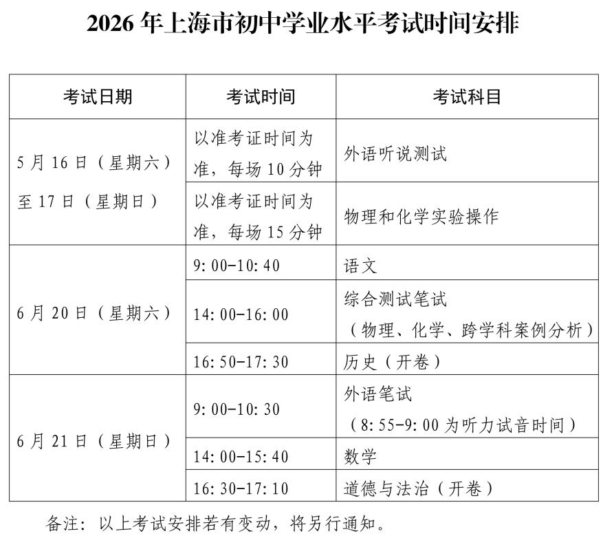
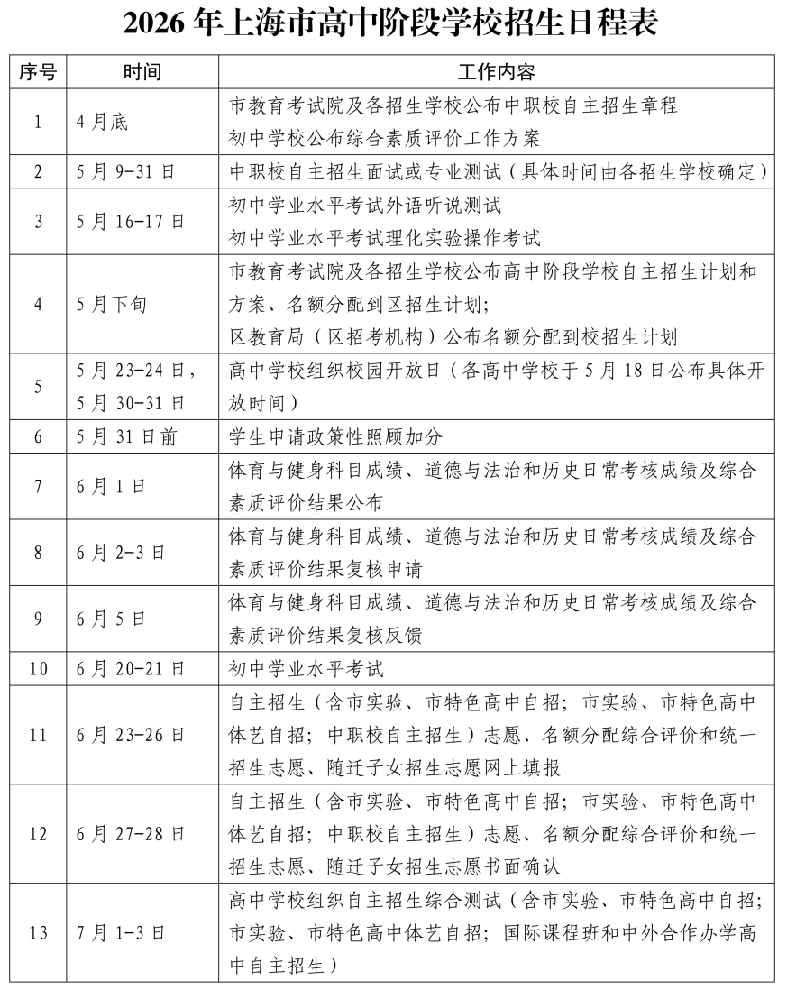
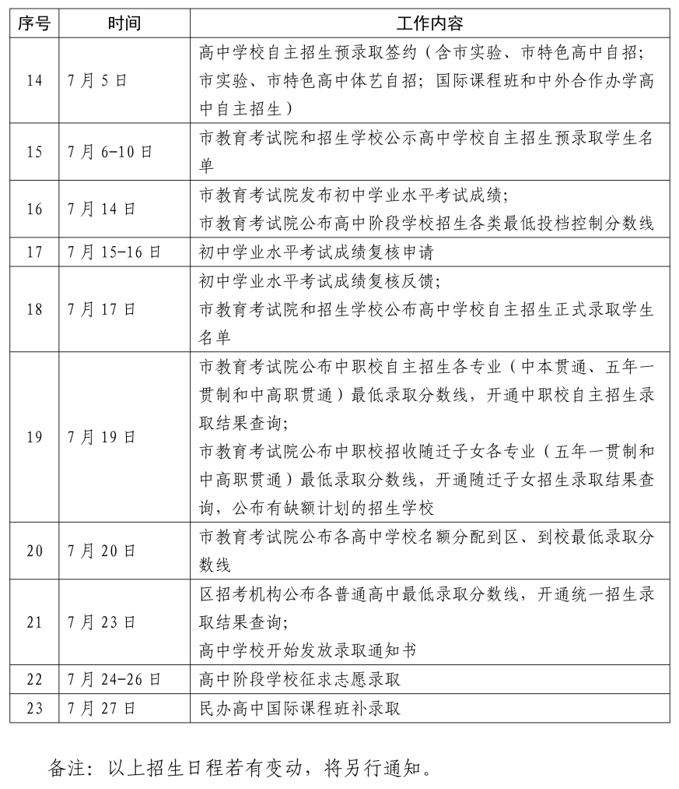
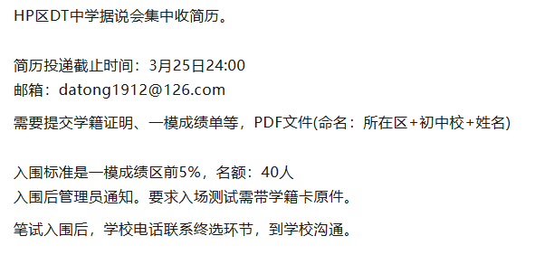

**2026年上海中考的日程已经出来了：**

**6月20日-21日中考**

**6月23日-26日**志愿填报****

**6月27日-28日志愿书面确认**

**7月1日-3日高中自招校测**

**7月5日自招预录取签约（有的学校可能更早打来“强电”）**

**7月14日中考成绩公布，后面几天各批次陆续公布录取结果**

****

  

最近初三自招有一则这样的小道消息，大家可以吃个瓜或者提前了解一下。

这个说的是什么学校，简直是谜底写在谜面上，大家一看邮箱就清楚了，就是黄浦区那所八大呗！牛娃们可以行动了。

前段时间还有其他八大自招的小道消息：

MH区QB：2月15日联系了一模成绩好、投递简历的家长，一部分直接给实验班承诺，另外一部分要求二模后把成绩单发过去。

YP区KJ中学：1月19日-1月25日，考数学和英语，合计200分。

  

首先给家长们科普一下以往被称为“四校之外的第二梯队”上海八大高中。

八大：七宝、南模、建平、控江、延安、格致、大同、复兴

  

很多人问我，自招不是在中考后吗？

八大其实和四校类似，也会有一些自招的提前动作，一般叫飞行考（FXK）或神秘考（SMK）。

初三第一学期，八大就会对**嫡系初中、优质民办/公办头部**的首次集中飞行考，主要锁定**年级前 5%、竞赛生、理科特长**学生，多为**突击通知**（考前 1–2 天），不公开报名，行动迅速所以叫“飞行考”。一般是越头部的学校开开始得越早。

1-2月一模前后是**FXK最高峰**，会大规模组织。以**一模高分**为核心筛选标准，范围扩大到全区乃至全市优质生源。与小升初类似，渠道有学校推荐、机构推荐和自荐，高中会与高分同学的家长联系。

3 月中下旬、4 月二模后，其实是补录性质，八大想要捡漏**四校、四分分****校淘汰生源**、二模黑马，名额少、竞争更激烈，多为**小规模、精准邀约。以前有部分学校与**开放日**结合，明面上是活动，暗地里是测试，但现在基本上不敢这么搞，开放日几乎都是参观活动。**

****6月中考后，进行自招校测和签约预录取。**自招暗动作给的口头承诺，不能保证一定上岸，最终还是要进行正式的校测、签约。今年6月23日-26日**志愿填报，7月1日-3日高中自招校测，这些流程都要走一遍。如果校测表现不佳，提前签约过的考生依然有被刷掉的可能，所以初中任何一场考试都要全力以赴！****

  

为了方便家长们**互相交流孩子教育经验、互换学习资料**，

我建立了**上海家长交流群****，你若主动交流，定能有所收获！无论是鸡娃爸妈还是不鸡娃家长，总能找到聊天搭子~**

**扫码后请****备注【年级】或【区】****！**

**（不然咋知道拉你进啥群？）**

往期文章：

[五校联考来袭！2026上海中考自招将更热闹！](https://mp.weixin.qq.com/s?__biz=MzkyNDYxMTUzOQ==&mid=2247496174&idx=1&sn=ea16817f04394ded360f198779027b85&scene=21#wechat_redirect)

[上海中考自招，传闻中的四校联考成真了！](https://mp.weixin.qq.com/s?__biz=MzkyNDYxMTUzOQ==&mid=2247493844&idx=1&sn=1df8741bf842533eef4f92fab8a02301&scene=21#wechat_redirect)

[几个上海公办初中娃的自招上岸经验](https://mp.weixin.qq.com/s?__biz=MzkyNDYxMTUzOQ==&mid=2247494409&idx=1&sn=d9b189b4f986911562a2f4ad9bd663f7&scene=21#wechat_redirect)

[恍然大悟！FXK、夏令营……终于看懂了上海中考自招！](https://mp.weixin.qq.com/s?__biz=MzkyNDYxMTUzOQ==&mid=2247490604&idx=1&sn=7241863d1908a3ad1818ceedb2119662&scene=21#wechat_redirect)

[2025自招情报：交附闵分、七宝、上实、建平、市西、控江](https://mp.weixin.qq.com/s?__biz=MzkyNDYxMTUzOQ==&mid=2247493849&idx=1&sn=7982cdbb0579bb1f5bfae8e5db84f68c&scene=21#wechat_redirect)

[最近SMK的同济科中，不容小觑！未来科学高中的样板就是它！](https://mp.weixin.qq.com/s?__biz=MzkyNDYxMTUzOQ==&mid=2247495116&idx=1&sn=9725ffd6df4456ba4f2df0256a8be262&scene=21#wechat_redirect)

[曹二自招，上岸难度堪比四校？参加C2银河夏令营、星云俱乐部有用吗？](https://mp.weixin.qq.com/s?__biz=MzkyNDYxMTUzOQ==&mid=2247493930&idx=1&sn=39c40a7d56ec86d2272b170041f1136d&scene=21#wechat_redirect)