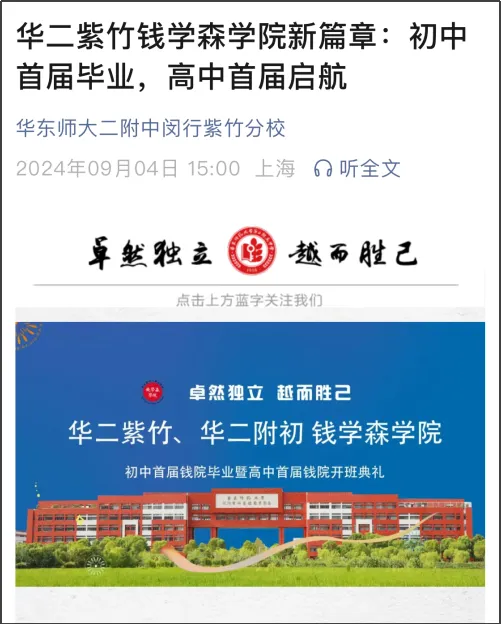
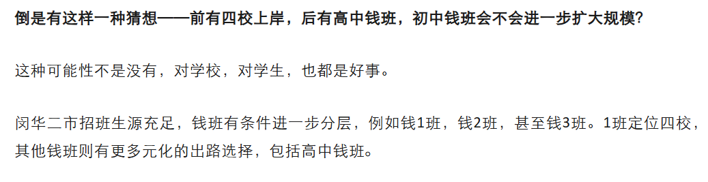

因为公众号平台更改了推送规则，如果想不错过内容，记得点下“赞”👍和“在看”⭐，最好星标公众号哦，这样每次新文章推送，就会第一时间出现在你的订阅号列表里🍀

  

这个问题最近被问到的次数较多。

  

先看一下这两所学校的情况：

  

sw（世外徐汇）初中分为普通班、双语班和融合班，三个班型在摇号时填报志愿，决定选择哪个班型报名。

  

普通班即境内班，双语班也是境内班，这两个班型的课程安排没什么差别，唯一区别可能在班级人数上。普通班每个班级学生数大约在46-48人，而双语每个班级25人左右，学费比普通班贵1000-3000块。融合班即境外班，学费贵很多。

  

普通班，中考路线，个别选择境外。双语班可以中考路线或境外路线。融合班则大多数去国际高中或直接出国。

  

所以sw在分班上是打通的，没有所谓的单独的一个“好班”。普通和双语班的授课内容、进度一致。

  

晚课会有英竞班和数竞班，六年级是每周各1次课，后面数学是每周2次课，英语还是每周1次。

  

选拔标准，英语根据每学期的期中期末的考试来确定。数竞班每学期都会洗牌，首先会根据期中期末考试的排名，划定一个分数段，在分数段内的同学才有资格参加选拔。是否参加选拔，自主报名。然后参加选拔考试，择优录取。

  

更多🔎[世外徐汇在读真实体验分享（体制内方向）](https://mp.weixin.qq.com/s?__biz=MzA3Nzc3OTEyOA==&mid=2247498046&idx=1&sn=c899b8ad9d9f6b29e8591c41b13c0ef2&scene=21#wechat_redirect)

mh2 初中的特色班是市招班+钱班。

  

市招班通常是3个左右，大约100+人，今年传言瘦身。现在大部分初中学校的特色班，对外宣称都是“蛇形分班”，即没有一个单独的行政班叫“好班”（单独好班可类比H8,H7）。

  

既然是蛇形分班，意味着没有实质性差别。从毕业情况来看，会有几个班级成绩好于其他班级，应该是将xsc择校娃+对口成绩好的娃+TZS组成。但总体来说各班级之间内容、进度无显著差异。与此同时，学校通过分层考试选拔出有潜力的苗子参加晚课。

  

mh2最突出的特色班级是“钱班”——钱学森学院是华二紫竹教育教团重点打造的初高贯通培养特色班级。

  

mh2初中钱班首建于2021年，最初设计规模25人，对标华二丘班。6年级选拔，7年级定班，随后每学期会补录，动态调整。生源来自市招班，考察数学、物理和信息成绩综合而定。

29届首次出现2个钱班，A、B班，A班即原来的钱班，B班介于A与平行班之间。A班定位竞赛方向，PK头部竞赛生源，出口定位旦旦营+四校自招；B班定位强综合方向，中高考综合为主，个别有天赋、有后劲的同学也可以参与竞赛。两个班级好比H8, H7的关系，学校对优秀生源进一步分层，提供有针对性的教学内容和升学路径。

这两年钱班生源质量有目共睹，非常亮眼。旦旦营上岸人数中，钱班可以占到10+人，与SBL、LS等一线头部理科班同一level。同时，隶属于华二集团系统内，钱班享受到的资源是非常好的，例如之前与丘班的互动联动，还有华二竞赛资源等。

在这基础上，不仅mh2有初中钱班，华二紫竹高中部2024年官宣“高中钱班”。

  

更多🔎[继闵华二钱班后，“高中钱班”落地华二紫竹](https://mp.weixin.qq.com/s?__biz=MzA3Nzc3OTEyOA==&mid=2247491760&idx=1&sn=cf7141277c6a22c7351f2a8526dd1419&scene=21#wechat_redirect)

  

  

上图是官宣创建首届钱学森学院是高中部的钱班，2024年，当时开班典礼与首届闵华二初中钱班毕业典礼同时举办。

有了高中钱班之后，mh2完全可以将生源更好地分层、分类管理，匹配定位到不同的高中出口。2024年文章猜测过钱班扩容👇：

说了那么多，mh2 vs sw 到底怎么选呢？

1\. 首看孩子特点和文理偏好

这两所学校在文理上有侧重，sw侧重英语，国际资源视野等，mh2侧重理科培养。

孩子如果理科强娃，有志于冲一冲钱班，mh2可能更合适。能够入选钱班的孩子对比一线理科班水平，家长估量一下孩子情况，冲一冲可以，但也不要强求，毕竟考钱班是进校之后的事情，xsc时决定不了。

2\. 家庭对国际资源和视野的需求

现在体制内外的教育理念和方法正不断打通融合，许多体制内家长对孩子教育方面，是否能够接触到国际资源和视野，有越来越高的要求。如果是这样，sw也许是更好的选择。

sw与欧洲高中有联谊关系，每年有机会给到优秀的孩子，海外交流。

选择sw的家长，相比mh2，对国际教育的诉求更高，去到一个学校即是进入某一种圈层，人以群分，各取所需。

3\. 家庭对竞赛资源的需求

mh2的竞赛资源毋庸置疑好于sw，sw基本没什么人搞竞赛。

如果孩子有志于在理科竞赛方面试一把，肯定选mh2。华二在五大学科竞赛上均有布局，是四校里理科竞赛资源最完整、全面的一所。

竞赛娃最好力争考进钱班，钱班是强竞赛氛围的班级，所给到的师资、课程、同学的匹配度非常适合竞赛娃。而后可以通过旦旦营、四校自招等升学。

4\. 距离

实际问题——两个学校的地理位置差别大，sw徐汇黄金地段，mh2闵行紫竹，如果去mh2上学，肯定要搬家过去了。

5\. 学费

实际问题——两个学校费用有一定差距，mh2公办，sw民办（普通班每学期3.5w，双语班3.6w，境外班不做参考），4年下来费用差异家长可以算算账。

以上。是两个学校择校的对比分析。

回过头来说，今年上岸那么难，有offer尽量拿下，上岸为先。手里有不同牌，再来考虑这甜蜜的烦恼吧。

以上是我们带来的**关于“上海升学相关”的分享内容**。如您有任何需要咨询或探讨的话题，欢迎联系魔都鸡娃经纪人或在群里讨论。

  

近期热点文章

Latest Trending News

[2026 NOI上海省队名单公布，上外5、华二4、曹二3人进队](https://mp.weixin.qq.com/s?__biz=MzA3Nzc3OTEyOA==&mid=2247498156&idx=1&sn=252ccd9efdf6ee201c357bc204d20dba&scene=21#wechat_redirect)

[数竞、信竞圈的一些消息](https://mp.weixin.qq.com/s?__biz=MzA3Nzc3OTEyOA==&mid=2247498147&idx=1&sn=3fe19bcafbf8b09cf4724381a1366dd6&scene=21#wechat_redirect)

[同济科技加入“四校联考”，会加入旦旦营么？](https://mp.weixin.qq.com/s?__biz=MzA3Nzc3OTEyOA==&mid=2247498133&idx=1&sn=ed6e8d8af3335159ab60c5602033ecbd&scene=21#wechat_redirect)

[丘班之后，那么旦旦营呢？](https://mp.weixin.qq.com/s?__biz=MzA3Nzc3OTEyOA==&mid=2247498124&idx=1&sn=f50416b1a27bc26ae27b79a50baea0b7&scene=21#wechat_redirect)

[H8、9班调动与Q班取消是两回事情](https://mp.weixin.qq.com/s?__biz=MzA3Nzc3OTEyOA==&mid=2247498103&idx=1&sn=965279138ff0427cf84f6aaa30f31ac3&scene=21#wechat_redirect)

[上海Q班取消？](https://mp.weixin.qq.com/s?__biz=MzA3Nzc3OTEyOA==&mid=2247498092&idx=1&sn=db65050e7438ac3e84e94304db69e7f6&scene=21#wechat_redirect)

[今年“三公”要变成众矢之的了么](https://mp.weixin.qq.com/s?__biz=MzA3Nzc3OTEyOA==&mid=2247498087&idx=1&sn=50c78cb3d34177bd5ccbab9dca67a0b7&scene=21#wechat_redirect)

[世外徐汇在读真实体验分享（体制内方向）](https://mp.weixin.qq.com/s?__biz=MzA3Nzc3OTEyOA==&mid=2247498046&idx=1&sn=c899b8ad9d9f6b29e8591c41b13c0ef2&scene=21#wechat_redirect)

[你想知道的关于【静教院附校】的...超大信息量](https://mp.weixin.qq.com/s?__biz=MzA3Nzc3OTEyOA==&mid=2247498041&idx=1&sn=580070a5a50df6ee8b74b64ea6ae6e01&scene=21#wechat_redirect)

[可能是市面上最好的【熟词生义】学习包](https://mp.weixin.qq.com/s?__biz=MzA3Nzc3OTEyOA==&mid=2247498032&idx=1&sn=ef759d9bd3ecc9a550fc4145655fce9c&scene=21#wechat_redirect)

[上海高考"3+3"怎么改革（含建议方案）](https://mp.weixin.qq.com/s?__biz=MzA3Nzc3OTEyOA==&mid=2247498020&idx=1&sn=2606fcd64cfe79d980ae37de3fc313f1&scene=21#wechat_redirect)

[旦旦营第一届参加中考，丘班呢？](https://mp.weixin.qq.com/s?__biz=MzA3Nzc3OTEyOA==&mid=2247498006&idx=1&sn=316ea526d7ebef7ec8625c2d8da1d76a&scene=21#wechat_redirect)

[人户分离政策收紧，对小升初的影响有哪些](https://mp.weixin.qq.com/s?__biz=MzA3Nzc3OTEyOA==&mid=2247497998&idx=1&sn=2a93f6d77b0b8a2bad7052e16dc5b268&scene=21#wechat_redirect)

[上海丘班小升初进度：H2Q两批面谈，JFQ/FFQ陆续启动](https://mp.weixin.qq.com/s?__biz=MzA3Nzc3OTEyOA==&mid=2247497955&idx=1&sn=5b25496ab7cb4b562cacb0b0a51d37f8&scene=21#wechat_redirect)

[华二丘班动了，意味着什么](https://mp.weixin.qq.com/s?__biz=MzA3Nzc3OTEyOA==&mid=2247497949&idx=1&sn=b643d6cf4a8c4323049f04b7b98f16d1&scene=21#wechat_redirect)

[中考志愿精准填报，压线上岸外区八大，如何做到](https://mp.weixin.qq.com/s?__biz=MzA3Nzc3OTEyOA==&mid=2247497926&idx=1&sn=11dd7c843f5bd0a8111d2ba455eafb12&scene=21#wechat_redirect)

[名师离开机构，要不要跟着去（原创观点分享）](https://mp.weixin.qq.com/s?__biz=MzA3Nzc3OTEyOA==&mid=2247497911&idx=1&sn=3e4c9f44f5b66b6b23d6a556a1a80fa9&scene=21#wechat_redirect)

[杨浦中考一模语文卷出炉，阅读书写量大（附参考答案）](https://mp.weixin.qq.com/s?__biz=MzA3Nzc3OTEyOA==&mid=2247497858&idx=1&sn=32338019190ade5311157b98cd09092b&scene=21#wechat_redirect)

[三公Top 2学校在读体验（在读家长分享）](https://mp.weixin.qq.com/s?__biz=MzA3Nzc3OTEyOA==&mid=2247497719&idx=1&sn=db324f6e8d4d4459276b016427af1b93&scene=21#wechat_redirect)

[第二届丘班峰会，上海选手继续霸榜](https://mp.weixin.qq.com/s?__biz=MzA3Nzc3OTEyOA==&mid=2247497636&idx=1&sn=b7d61132be31ffbe6228b61fd75ac79b&scene=21#wechat_redirect)

[交附丘班今晚官宣，魔都四大丘班集结号](https://mp.weixin.qq.com/s?__biz=MzA3Nzc3OTEyOA==&mid=2247497570&idx=1&sn=5786e2aae8b939f6995507ae134eb82a&scene=21#wechat_redirect)

[旦旦营第三届，秋季营结营](https://mp.weixin.qq.com/s?__biz=MzA3Nzc3OTEyOA==&mid=2247497500&idx=1&sn=709c715a8651fa1250946f0788532995&scene=21#wechat_redirect)

[上中首度1人入选物理国家队](https://mp.weixin.qq.com/s?__biz=MzA3Nzc3OTEyOA==&mid=2247497474&idx=1&sn=5a4ab96ea441db183446e488c36e6e4d&scene=21#wechat_redirect)

[今年小升初的一些随感](https://mp.weixin.qq.com/s?__biz=MzA3Nzc3OTEyOA==&mid=2247497436&idx=1&sn=ae4860da843ba68dc1d4172660004b00&scene=21#wechat_redirect)

[从初三自招经历，回看小升初择校（一线理妈妈分享文章）](https://mp.weixin.qq.com/s?__biz=MzA3Nzc3OTEyOA==&mid=2247497397&idx=1&sn=9112c0d3e97bd0e31e3b5faf696bb5c2&scene=21#wechat_redirect)

[熟词生义2+母语者眼中的“定语从句”（英语干货分享）](https://mp.weixin.qq.com/s?__biz=MzA3Nzc3OTEyOA==&mid=2247497321&idx=1&sn=76a65b3e65fd96d4098070223afb4b1b&scene=21#wechat_redirect)

[NOIP分数线公布，华二、上外、曹二三足鼎立，初中生成绩值得关注](https://mp.weixin.qq.com/s?__biz=MzA3Nzc3OTEyOA==&mid=2247497240&idx=1&sn=461ab3acc188b7329ef7506abefc9cb7&scene=21#wechat_redirect)

[Copy了一份上中，上海“第五校”的理科豪华阵容登场](https://mp.weixin.qq.com/s?__biz=MzA3Nzc3OTEyOA==&mid=2247497199&idx=1&sn=61d7833c3f80b2e608bd424185f23366&scene=21#wechat_redirect)

[2025 NOIP分数及民间分数线观感](https://mp.weixin.qq.com/s?__biz=MzA3Nzc3OTEyOA==&mid=2247497167&idx=1&sn=5fb6cae328fe12e0c14f68876c34d35f&scene=21#wechat_redirect)

[2025 CMO国集名单（网传版）](https://mp.weixin.qq.com/s?__biz=MzA3Nzc3OTEyOA==&mid=2247497074&idx=1&sn=4c195e9981e55141fa5e56dcc7a63904&scene=21#wechat_redirect)

[NOIP考完后，整个人还好吗？分数线是升是降？](https://mp.weixin.qq.com/s?__biz=MzA3Nzc3OTEyOA==&mid=2247496935&idx=1&sn=563a6e0410b421b1dc42c1bd12b3aedf&scene=21#wechat_redirect)

[NOIP今日开战，初中生头部选手有哪些](https://mp.weixin.qq.com/s?__biz=MzA3Nzc3OTEyOA==&mid=2247496894&idx=1&sn=a9cc8cf4e4cf795ba1277652c10c2ff1&scene=21#wechat_redirect)

[满满都是坑的“熟词生义”（英语干货分享）](https://mp.weixin.qq.com/s?__biz=MzA3Nzc3OTEyOA==&mid=2247496856&idx=1&sn=04f6068e794537e4c2e0a55becc4a7f5&scene=21#wechat_redirect)

[神仙打架CMO开幕，20+国集选手返场](https://mp.weixin.qq.com/s?__biz=MzA3Nzc3OTEyOA==&mid=2247496748&idx=1&sn=82ae2f733486fddeb2fe6beb9194244a&scene=21#wechat_redirect)

[“签约四校”签的到底是什么？（含近期四校FXK及自招进度）](https://mp.weixin.qq.com/s?__biz=MzA3Nzc3OTEyOA==&mid=2247496705&idx=1&sn=bf016d24703dd9366c50eda176265966&scene=21#wechat_redirect)

[旦旦营第一届要“退回”中考？](https://mp.weixin.qq.com/s?__biz=MzA3Nzc3OTEyOA==&mid=2247496610&idx=1&sn=fe8f51ea5cada66995839e8eac05c323&scene=21#wechat_redirect)

[2025上海NOIP名单的解读](https://mp.weixin.qq.com/s?__biz=MzA3Nzc3OTEyOA==&mid=2247496531&idx=1&sn=e4b9da709ae150dfced9403189941bc8&scene=21#wechat_redirect)

[港大本科生项目Delta+落地上海张江，明年第一届](https://mp.weixin.qq.com/s?__biz=MzA3Nzc3OTEyOA==&mid=2247496432&idx=1&sn=f07f7e037c5e38c24149b5540144a2ff&scene=21#wechat_redirect)

[清华丘领军失利的上海学子](https://mp.weixin.qq.com/s?__biz=MzA3Nzc3OTEyOA==&mid=2247496384&idx=1&sn=f3708685f8c8b8a710a905b7690426ab&scene=21#wechat_redirect)

[上海化竞3国集，有人稳定发挥，有人逆风翻盘](https://mp.weixin.qq.com/s?__biz=MzA3Nzc3OTEyOA==&mid=2247496342&idx=1&sn=bf010afcb62c3266adc930f3f6ed7063&scene=21#wechat_redirect)

[有关“学科竞赛”的一则新规](https://mp.weixin.qq.com/s?__biz=MzA3Nzc3OTEyOA==&mid=2247496312&idx=1&sn=ccef5982ca3971f4d1752dabd2445484&scene=21#wechat_redirect)

[如何看待近期陆续动作的四校FXK](https://mp.weixin.qq.com/s?__biz=MzA3Nzc3OTEyOA==&mid=2247496260&idx=1&sn=c05c35e69cb1e6b7801e638b4a43e7d6&scene=21#wechat_redirect)

[又一年，信息学CSP-J/S复赛今日举行](https://mp.weixin.qq.com/s?__biz=MzA3Nzc3OTEyOA==&mid=2247496222&idx=1&sn=230934857a6b2b3d83044da7ff57134e&scene=21#wechat_redirect)

[2026届小升初](https://mp.weixin.qq.com/s?__biz=MzA3Nzc3OTEyOA==&mid=2247496182&idx=1&sn=1564f70d37ee6e7cd98cf1df9c046621&scene=21#wechat_redirect)

[上海化学国金预测13人，华二5，复附上外3](https://mp.weixin.qq.com/s?__biz=MzA3Nzc3OTEyOA==&mid=2247496098&idx=1&sn=bf891b5177e0125c4c61e3911ac9434e&scene=21#wechat_redirect)

[2025化学竞赛国决分数线预测（协调前）](https://mp.weixin.qq.com/s?__biz=MzA3Nzc3OTEyOA==&mid=2247496064&idx=1&sn=879dfaade5bac3c51fe6d0dbf8fbea58&scene=21#wechat_redirect)

[2025物理国集名单（查分前），上海入选6人](https://mp.weixin.qq.com/s?__biz=MzA3Nzc3OTEyOA==&mid=2247495994&idx=1&sn=bbaf113466d672843804ce5157de3c32&scene=21#wechat_redirect)

[“长学制、贯通培养”热议下，这所学校值得关注](https://mp.weixin.qq.com/s?__biz=MzA3Nzc3OTEyOA==&mid=2247495947&idx=1&sn=5682d9dcb9d005dc9568bd219f3b6eec&scene=21#wechat_redirect)

[市教委的官方回应来了：长周期贯通培养并非取消中考](https://mp.weixin.qq.com/s?__biz=MzA3Nzc3OTEyOA==&mid=2247495904&idx=1&sn=e76fbc33fc27aa4dbd03039ef31c2624&scene=21#wechat_redirect)

[上海要取消中考了吗？](https://mp.weixin.qq.com/s?__biz=MzA3Nzc3OTEyOA==&mid=2247495854&idx=1&sn=c0fb30d49832105706c223e6e4a6e592&scene=21#wechat_redirect)

[2023-25上海数物化省队分布，今年华二追平上中，学校来源更集中](https://mp.weixin.qq.com/s?__biz=MzA3Nzc3OTEyOA==&mid=2247495813&idx=1&sn=1c4b24bfa1cc8cba69a73361486d7216&scene=21#wechat_redirect)

[今年四校自招新政的一些实操情况，一线理科班择校还有必要吗？](https://mp.weixin.qq.com/s?__biz=MzA3Nzc3OTEyOA==&mid=2247495456&idx=1&sn=5772ae7b790770fc09131646aaec81da&scene=21#wechat_redirect)

[五大联赛即将开战，新一批清北保送生已经在路上了](https://mp.weixin.qq.com/s?__biz=MzA3Nzc3OTEyOA==&mid=2247495431&idx=1&sn=f8e6c3423a1524890d7fd953522ee34c&scene=21#wechat_redirect)

[再谈“丘班风波”](https://mp.weixin.qq.com/s?__biz=MzA3Nzc3OTEyOA==&mid=2247495419&idx=1&sn=cc4b32bc79635d3fa994ee1ed421ca51&scene=21#wechat_redirect)

[“丘班”起风波](https://mp.weixin.qq.com/s?__biz=MzA3Nzc3OTEyOA==&mid=2247495412&idx=1&sn=5911b45bf83b0eadb253f19033fcfa84&scene=21#wechat_redirect)

[旦旦营近况，四校初中部日益壮大](https://mp.weixin.qq.com/s?__biz=MzA3Nzc3OTEyOA==&mid=2247495403&idx=1&sn=e32da692d8433b2226f05291ff907118&scene=21#wechat_redirect)

[复旦数学营第二届的上岸消息](https://mp.weixin.qq.com/s?__biz=MzA3Nzc3OTEyOA==&mid=2247495395&idx=1&sn=be5bab28ab2c9ec21ef874d04cbb6d56&scene=21#wechat_redirect)

[第二届蛋蛋营的家长会短信来了](https://mp.weixin.qq.com/s?__biz=MzA3Nzc3OTEyOA==&mid=2247495372&idx=1&sn=eed87969237faeb278e0174d25d6d909&scene=21#wechat_redirect)

[2025年复旦数学营报名通道开启，7升8报名](https://mp.weixin.qq.com/s?__biz=MzA3Nzc3OTEyOA==&mid=2247495370&idx=1&sn=ea7aea888b55cd39a96ac40f1b59109c&scene=21#wechat_redirect)

[复旦数学营今年还举办吗？](https://mp.weixin.qq.com/s?__biz=MzA3Nzc3OTEyOA==&mid=2247495361&idx=1&sn=eb36910bc9d95a9dd740bcb6e5d5a8dc&scene=21#wechat_redirect)

[2025清北复交录取，战况小结](https://mp.weixin.qq.com/s?__biz=MzA3Nzc3OTEyOA==&mid=2247495202&idx=1&sn=e188f72b7ca7b6a71632f231f2b8def8&scene=21#wechat_redirect)

  

  

我们有下面几个类别的交流园（qun）,

**🌱** **豆蔻园：**适合幼儿园阶段；

****🌷** 而立园：**适合小学阶段；

🚣‍♀️ **彼岸园：**适合9月份新五，小升初阶段；

****🌼** 不惑园：**适合初中阶段；

**☁️** **知命园：**适合高中阶段；

****🔬** 数创园：**适合对**数竞、信竞等五大理科竞赛**及**科学创新**感兴趣的小朋友；

🌍 **洋洋园：**适合体制外；

**✨ 逍遥派：**（筹备ing）；

  

目前，交流园（qun）都已满员，如果你想入园（qun），请扫描下方的二维码，添加“**魔都鸡娃经纪人**”微信号，并告诉她你想加入哪个园（qun），她会拉你

👇

