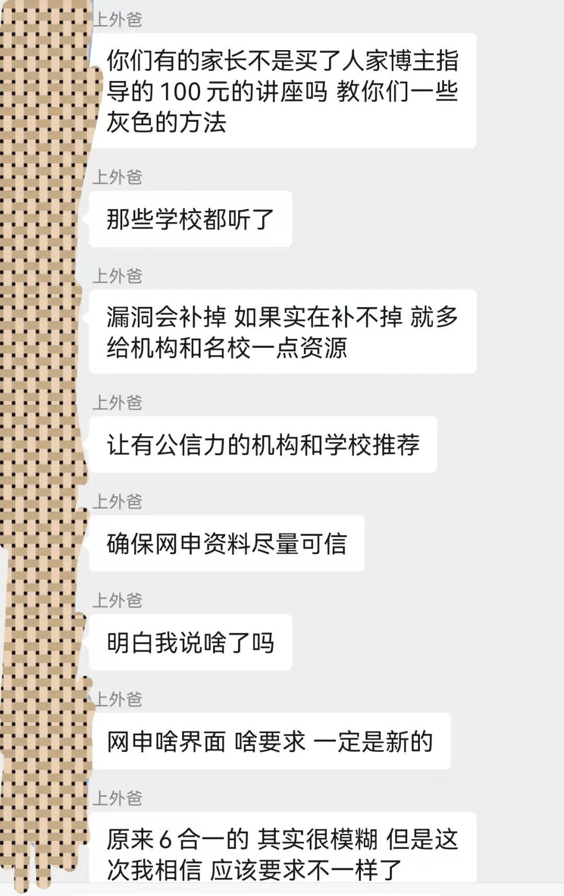

前段时间，小狐狸做了一个100元的付费讲座，讲了一些不太好的灰色技巧。这个东西确实有用，但原则上不太能放在台面上说。讲座名额其实小狐狸是严格控制数量的，目的就是为了保住购买的家长群体的利益。

[三公史量级的干货都在此(拿面单也有暗门)](https://mp.weixin.qq.com/s?__biz=Mzk1NzkxNDU1Nw==&mid=2247486223&idx=1&sn=36ed0e75bfe0537ae9aea60824a52a56&scene=21#wechat_redirect)  

[野路子！](https://mp.weixin.qq.com/s?__biz=Mzk1NzkxNDU1Nw==&mid=2247486229&idx=1&sn=c4f3ea1c9bb162099de50ad67f09a727&scene=21#wechat_redirect)  

这个讲座截止至今，一共售出27份，原本打算卖25份就结束的，但是有两位家长是小狐狸的老学员，所以就额外破例加了二单。这个讲座并非持续售卖，目前为止狐狸也没有再售卖了，因为卖的越多，技巧就越容易失效。本来这二十来个家长自己窝在被窝里听听，一笑而过也就算了，但是没有想到在购买讲座的人里，混进来了一位疑似同行的奸细前来购买！

  

同行如果听到这个讲座，那么其危害及后果肯定是不堪设想的，果不其然。昨天，这位博主的社群炸了

很显然，同行把小狐狸举报了，把这个讲座的内容倒给学校听了。其自己也在社群里承认了！

  

这个讲座，其实倒给学校听也没啥问题，毕竟小狐狸在购买之前和大家也说过，原则上我不建议大家用这个技巧的。其实狐狸是做了一件售卖香烟的事，明知道香烟有害健康，但还是卖了。既然如此，为何这样呢？

  

1.这个方法，黄牛和一些没有任何资源的“阿乌乱”机构都昧着良心集体在用，这个方法最早狐狸不是原创，是从黄牛圈里听来的。

  

当时，小狐狸就纠结过，与其让黄牛继续骗着家长这大五万的面单钱，不如把这个方法放到阳光底下告诉家长和学校

  

2.这个方法确实比较灰色，不太好。但凡正路子能够走通，拿到面单的孩子我都不推荐你来学。所以在这个角度上说，这个方法可能确实会触及到一部分既得利益者的怒火。

  

但，小狐狸是控制数量的啊！一共才卖了27人，又不是270人，也不是2700人。就区区这27个人能掀起什么浪花？不过就是悄悄咪咪的进城...

  

3.对于一些努力了三四年，花费了各种时间成本，金钱成本来备战三公的孩子，作为校方和那些把这个技巧捅破天的同行们你们有没有想过他们这些娃的感受呢？

  

其实这部分娃的占比是多数，能完全靠自己拿到面单的毕竟是少数，AMC8满分，小托福满分的整个上海又能有多少？

  

如果是这部分家长今天把狐狸举报了，狐狸无话可说，完全理解。但是作为同行，作为自媒体博主如果过分扩大这种事，那么对于得到这个技巧的家长来说今年肯定是比较艰难了。

  

上外爸的观点，小狐狸同意一部分。如果机器的漏洞能快速补上，那么小狐狸讲座里提到的这个技巧成功率自然是会少一些的。所以上外爸实际上不应该在社群里大肆宣扬，应该点对点的告知家长，这种技巧一旦被自媒体知道，那么失效的可能性很高。

  

很显然，小狐狸是被自媒体同行搞了，这位同行拿着小狐狸的讲座去举报了！

  

那么关于上外爸的观点，小狐狸更偏向于也更加呼吁面单的发放可以将份额多发放给一些优质的小学，面单如果一旦开了和机构对接的口子，那么市场将又会紊乱了！

  

另外，小狐狸再次强调，讲座里教授的这些其本质还是想还原黄牛和机构的这些拿面单的套路，其初心不是让大家以野路子为目的，而是希望大家可以不要被这些黄牛和机构骗，当遇到这些骗局时可以尽早的有所识别！