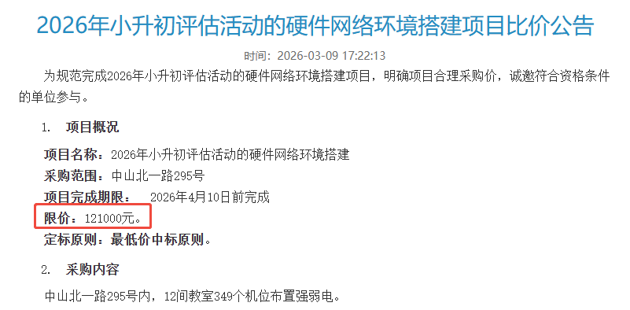
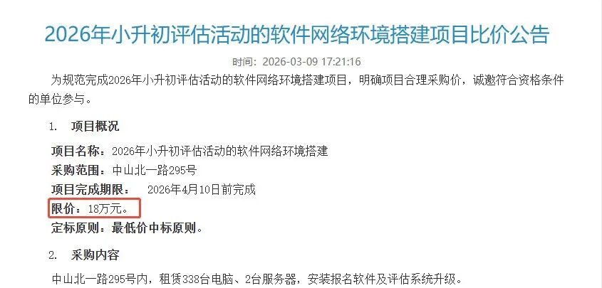

  

大家都知道，上外附中去年小升初招生明确评估方式为“人机对话”，其实意思就是机考，入校用电脑考试。这也是上外附中多年小升初评估的常规形式。

  

01

系统升级消息

今年上外附中发了公告，表示要完成小升初评估活动的硬件、软件网络环境项目搭建，约30万预算。所有项目需在4月10日前完成，与往年三公评估时间节点高度契合。

为了招到心仪的学生，此次升级系统，也是下了血本！

  

02

考位预估

去年4.19上外附中有6批考生参加小升初评估。

结合这次项目租赁电脑台数338台，如果评估也是分为6批，今年足以容纳2028人参考。而12个教室每个教室约29台电脑，但其中有部分电脑是备用，实际上每个教室大约只有25个考位。

前两年上外附中招生计划都是240人，上外东校计划招生120人，同样是在上外附中评估，自媒体估算前两年上外附中的面单数大概在1200-1600左右。

而今年，预计可容纳300×6=1800人考试。

今年招生人数和发放面单数是否会有所增加？令人期待。

  

03

考试会变难吗？

明确一点，此次升级不会改变评估形式，而是进一步巩固并优化全机考模式。

机器评分能有效规避面谈的主观偏差，减少暗箱操作的可能。作为外语特色名校，上外附中的评估核心是考察孩子的英语素养、逻辑推理和快速学习能力，机考恰好能精准覆盖这些维度，包括英语听力、小语种现场模仿、数学逻辑推理及跨学科融合题型，本质是筛选综合能力全面的孩子，这也与学校培养国际化人才的定位高度匹配，备考需围绕这些核心展开。

核心备考方向已明确，无需纠结是否会回归人对人的面谈，重点放在机考能力提升上即可。升级后的机考很可能进一步强化标准化，采用不可逆答题、全程录像等措施，杜绝作弊可能。

建议家长调整备考策略，重点训练机考适配能力，包括屏幕阅读效率、限时答题节奏、口语录音标准度等。同时夯实核心学科基础，英语需达到小托福850+水平，重点突破听力和口语；数学侧重逻辑推理与跨学科题型训练，此外还要注重孩子专注力和抗压能力的培养，避免考场上因紧张失误。

上外如果升级了机考系统，浦外、上实是否也会跟进？目前，浦外、上实官网尚未有系统升级的相关公告。

三所学校的评估系统互相独立，题型也不相同。可以回顾往年考情：

[2025三公评估真题回忆，孙子算经、孙悟空吃桃、塞翁失马……](https://mp.weixin.qq.com/s?__biz=MzkyNDYxMTUzOQ==&mid=2247493311&idx=1&sn=6865eb06328e92763e187c3350ba5797&scene=21#wechat_redirect)

[2024三公评估题目概览及辣评](https://mp.weixin.qq.com/s?__biz=MzkyNDYxMTUzOQ==&mid=2247485114&idx=1&sn=48f4e6072bafb56dfe37137f74c6b4fe&scene=21#wechat_redirect)

还有家长问参加机考需不需要打字。以往上实、上外附中、浦外都出现过打字的题型。建议每位同学都熟练掌握电脑打字法，有备无患。这也是AI时代最最基本、必须掌握的技能。

  

为了方便家长们**互相交流孩子教育经验、互换学习资料**，

我建立了**上海家长交流群****，你若主动交流，定能有所收获！无论是鸡娃爸妈还是不鸡娃家长，总能找到聊天搭子~**

**扫码后请****备注【年级】或【区】****！**

**（不然咋知道拉你进啥群？）**

往期文章：

[从丘班到三公，小升初面谈怎么准备？](https://mp.weixin.qq.com/s?__biz=MzkyNDYxMTUzOQ==&mid=2247495745&idx=1&sn=b731d099678b76cd1e42ab0720133f60&scene=21#wechat_redirect)

[四校/三公/浦东/闵行/徐汇部分高中2025高考成绩](https://mp.weixin.qq.com/s?__biz=MzkyNDYxMTUzOQ==&mid=2247494177&idx=1&sn=0f8c3a4bf4ac89a1e658804a62137caf&scene=21#wechat_redirect)

[上外附中 “科创班” 的爽文之路！舍得投入就是不一样！](https://mp.weixin.qq.com/s?__biz=MzkyNDYxMTUzOQ==&mid=2247494582&idx=1&sn=772668344682ecdcf438ab1133275ca1&scene=21#wechat_redirect)

[NOI信奥上海市队名单公布，上外附中又冲到榜首了！](https://mp.weixin.qq.com/s?__biz=MzkyNDYxMTUzOQ==&mid=2247496230&idx=1&sn=d361b488907191c864864a3b1046b478&scene=21#wechat_redirect)

[上海小升初大变天，哥带弟双双考进三公！早知如此，当初就……](https://mp.weixin.qq.com/s?__biz=MzkyNDYxMTUzOQ==&mid=2247493546&idx=1&sn=0d61af3a27bf11513eb8656cd326cc34&scene=21#wechat_redirect)

[2025上海三公招生简章已公布！浦外扩招利好浦东牛娃，上外附中评估方式明确！](https://mp.weixin.qq.com/s?__biz=MzkyNDYxMTUzOQ==&mid=2247493238&idx=1&sn=9444ac6189f234863e4c7bad5d72236e&scene=21#wechat_redirect)