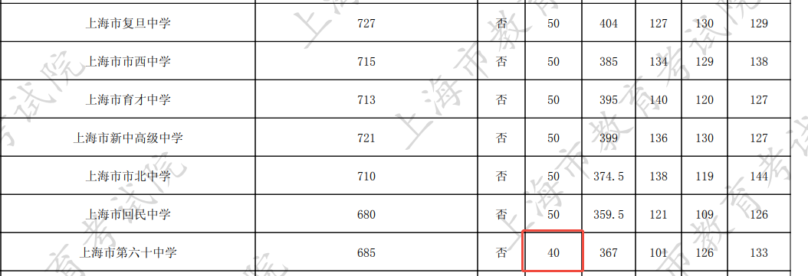
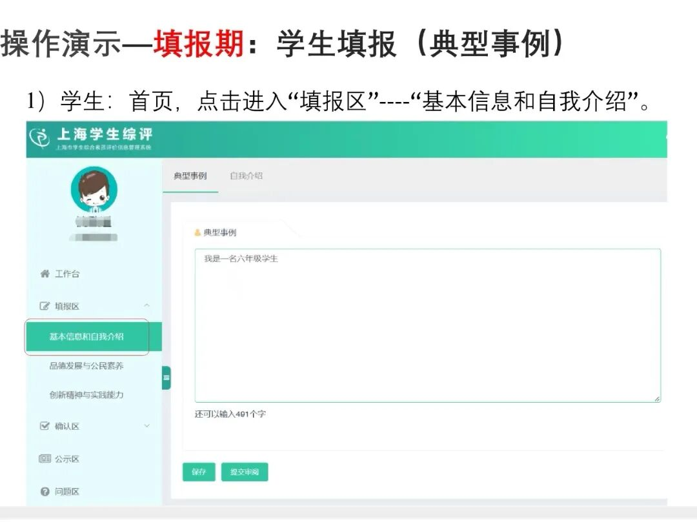
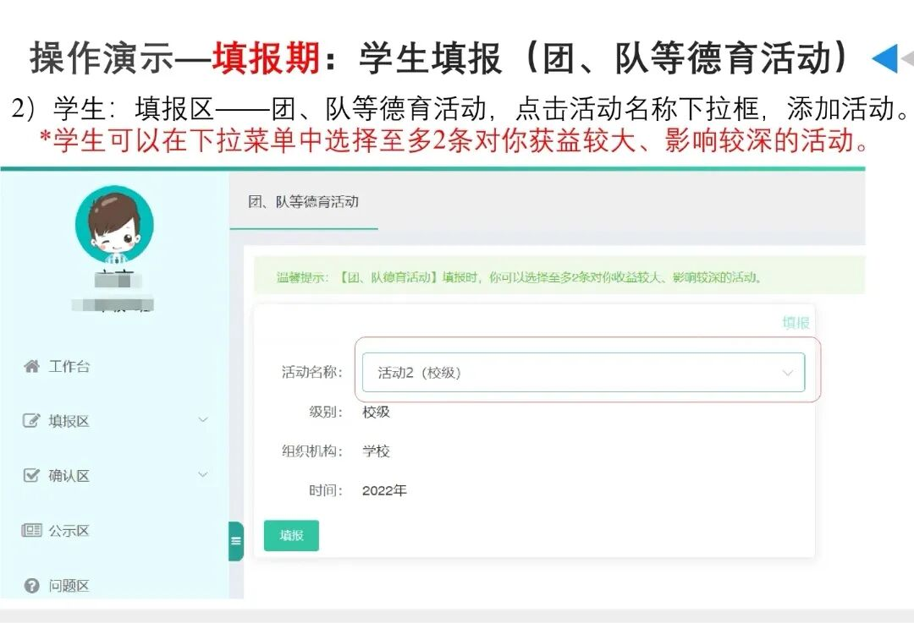
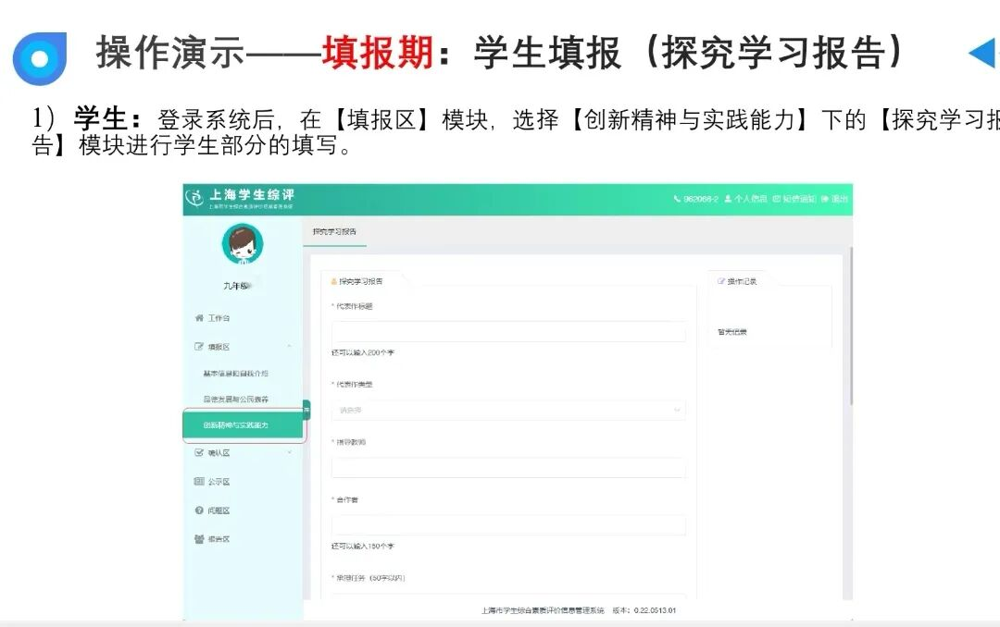

  

这段时间，很多初中生在填综评。咱们鸡娃群友讨论得热火朝天的，但往往存在很多误区，有的家长以为综评无用就不需要填了，差点“误了大事”。

一句话总结：上海初中综评每位同学、每个年级都得填，它是初中毕业的必要条件，也是中考名额分配录取的核心依据。填好了就是合格，大家都是50分满分，不填、漏填可能会导致“不合格”，被扣分。

综评影响的不是自招，也不是统招平行志愿，而是名额分配。名额分配批次的全称是“名额分配综合评价录取”，包含“名额分配到区”和“名额分配到校”。

名额分配总分 = 中考750分 + 综评50分 = 800分

名额到区，考生可以填1个志愿，全区填了某个到区志愿的同学一起PK，择高录取。

名额到校，在籍在读满3年的应届初三生考生可以填2个志愿，全校填了某个到校志愿的同学一起PK，择高录取。

2025年上海中考徐汇名额到区，有一位同学可能因为综评漏填少填，就没拿到满分，只拿了40分，末位惊险上岸静安的六十中学。

  

如果综评拿到满分，685分加上10分，当年695分，徐汇考生名额到区应该可以去黄浦的大境中学、浦东的南汇中学等。

  

想拿满综评这50分其实不难，填好综评网必填内容基本都可以拿到。

综评系统，学生必须填写的3个核心必填项：

1\. 典型事迹/自我介绍

六到八年级每学期都要填500字以内典型事迹，学生可以写自己学习、运动、参加各种活动的经历。

九上要填写500字以内的自我介绍，突出品德态度、学习习惯、实践活动等。

具体是填400字还是200字其实都不太影响，但是只有单薄的一两句话，或者捣蛋乱写就可能“不合格”。

2\. 共青团/少先队等德育活动

每学期最多填2条。这些活动一般是全班参与的，直接在菜单里选择。

3\. 探究学习报告

这个探究活动很多学校可能会在八下、九上组织，也有学校可能会在低年级开展相关活动，高年级到了时间再去填写系统，把更多时间留给中考备考。

这是鼓励初中生开拓视野的活动，不需要花钱请机构来写，更不用卷出研究生论文的高度，只要跟着学校的安排走就可以了。具体要选什么题目，怎么开展探究学习，分组还是个人行动，家长可以提前问问老师，确认清楚。

还有很多其他内容，比如市级艺术团等，学校录入员会帮学生填好，家长只需要检查核对就可以了。

群友总结得很好：综评没有“大用”，但是一定要根据学校要求填满。

你们今年的综评填好了吗？

  

为了方便家长们**互相交流孩子教育经验，**

我建立了**上海家长交流群****，你若主动交流，定能有所收获！无论是鸡娃爸妈还是不鸡娃家长，总能找到聊天搭子~**

**扫码后请****备注【年级】或【区】****！**

**（不然咋知道拉你进啥群？）**

往期文章：

[上海学生的五育评选又开始了！](https://mp.weixin.qq.com/s?__biz=MzkyNDYxMTUzOQ==&mid=2247496183&idx=1&sn=49d9b43496f78ea668b1e914169e22ce&scene=21#wechat_redirect)

[纯干货！上海学生五育评比，建议填这些奖项证书](https://mp.weixin.qq.com/s?__biz=MzkyNDYxMTUzOQ==&mid=2247496246&idx=1&sn=7b62522ed5bd0605d0c6c8403008f766&scene=21#wechat_redirect)

[NOI信奥上海市队名单公布，上外附中又冲到榜首了！](https://mp.weixin.qq.com/s?__biz=MzkyNDYxMTUzOQ==&mid=2247496230&idx=1&sn=d361b488907191c864864a3b1046b478&scene=21#wechat_redirect)

[2026上海中考日程已出！自招给重点高中投简历，还有用吗？](https://mp.weixin.qq.com/s?__biz=MzkyNDYxMTUzOQ==&mid=2247496255&idx=1&sn=6feb6a40f0d31d1eeeeeead87581f193&scene=21#wechat_redirect)

[上海体育中考项目选什么好拿分、少失误？最通俗易懂的攻略，收好！](https://mp.weixin.qq.com/s?__biz=MzkyNDYxMTUzOQ==&mid=2247496021&idx=1&sn=9119df1d21b917a9f88d2032040ee451&scene=21#wechat_redirect)