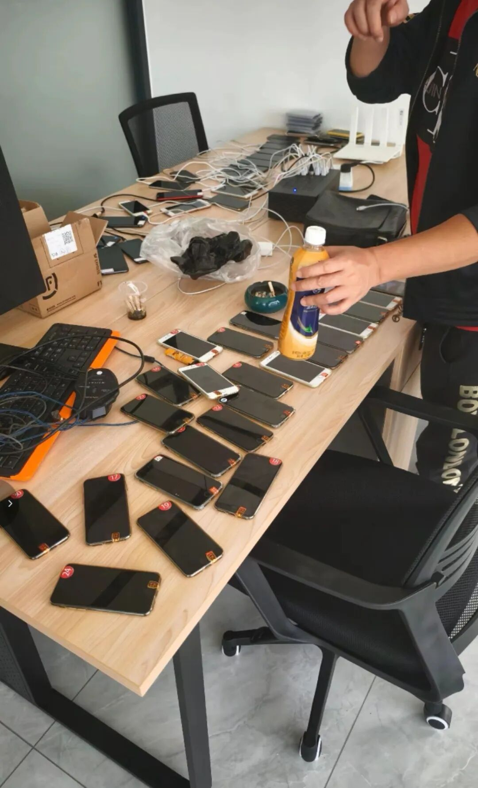
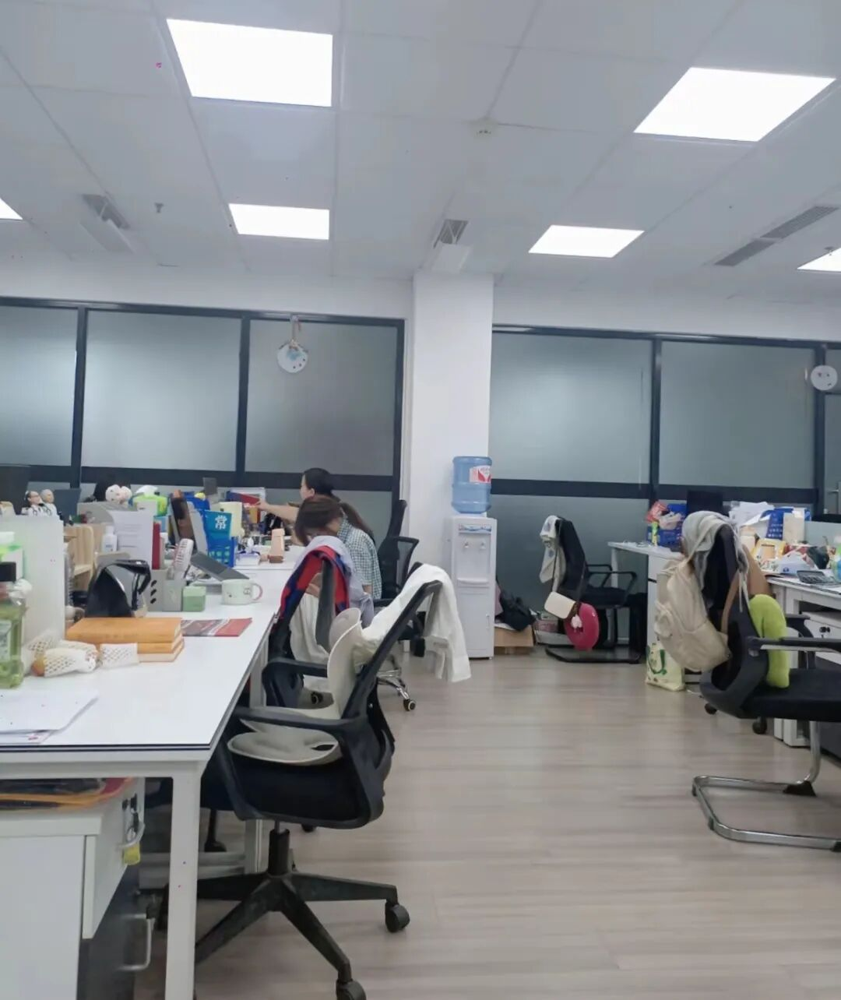

这个骗子团伙不可怕，真正可怕的，让同行们脊背发凉的是他背后的这个幕后黑手可能就藏匿于你我身边。起初，小狐狸看这个事情，猜测可能是学校的线，比如某个领导通过白手套来操盘。但后又迅速的否认了这个观点。

  

1.体制内的领导看不上这些倒门票的小钱，倒大几十万的名额是有可能，倒门票就为了几千元好像太寒酸了些，故而不太可能

(特别注明："倒"读作第三声，非第四声，意思为“倒卖，售卖”之意，是择校圈人尽皆知的专业术语)

  

2.如果是学校放出来的线，不可能所有机构都能覆盖到，这个黄牛团伙明显不是在一二家机构这里蹿腾，而是很多机构的考试信息和地点都能拿到，并且提前放票，然后带家长去冲考，这也不像是学校的手笔。因为它不只是拿到某一个学校的考试信息，而是机构的月考也能拿到信息

  

(另外，平陆路那场考试的完整地址是平陆路496弄的一家教育机构内，大家可以顺着这个线索去查查)

  

排除了学校方面的嫌疑后，狐狸仍将矛头指向了机构！他的背后一定有个黑手在操盘，而这个黑手应该就是机构，原因如下：

  

1.这个骗子团伙和一般的黄牛不一样，一般的黄牛纯粹就是骗钱，自己组织假考试，然后自己在小红书上放，你可以理解为就是自己建造一条考试流水线，然后在这条流水线上操作，一般不太可能和机构产生如此多的联结

  

所以！是机构！是机构！还得是机构！

  

2.这个幕后黑手不可能是机构内部的基层员工，因为普通员工没有这么大胆子，也没那么强的能力来操盘这个盘子，把这个矩阵玩明白，所以这个幕后黑手的定位应该是机构的老板或者是某一位股东又或者是一个能接触到核心商业机密的机构内部的高层人员

  

3.这个幕后黑手应该是在核心圈子的，和众多机构的老板或者股东们都有交流，应该藏匿的很深，因为从黄牛的倒放信息来看，资源覆盖各个学校，各个机构，所以只有核心圈的大卡拉米才有这个信息渠道。别忘记，机构对家长说的是月考，是内测，但黄牛却称是平A，是市北理的考试。这么精准的圈内信息到底是如何被泄露的呢？值得深究！

  

所以！是机构老板！是机构老板！还得是机构老板！

  

4.这家机构应该就在狐狸上次发的机构投票名单里那24家机构的其中一家，也不排除有这样一个可能就是，这个团伙同时可能是好几家机构的下线，比如打个比方蘑而思下面的一个小弟和学伟思下面的一个小弟互换了信息，新牛的人给了答舟的小弟香臻要考试的信息，花蕉的小弟倒放了梨宫的考试信息。这种可能性也是存在的，如果是这样的话那么就不单某一家机构暗中从事黄牛业务了，而是整个行业的乱像，整个教培机构都在暗戳戳的从事黄牛生意了！开启了全民搞择校时代嘞！

  

5.幕后黑手和这个团伙是这样合作的：幕后黑手负责提供其他机构的考试信息，在圈子里套取到竞争对手的考试信息后转手倒给了黄牛圈的小弟。而黄牛注册了一个择校信息咨询公司，从号商这里每个月购入一批新号，雇佣了三四个人然后在小红书上同时间推出，同步倒卖。

  

小狐狸去沪上很多家择校公司视察走访过，这个行业其实还是有一些真正在做事的黄牛的，有几家狐狸实地探访过他们的办公地点。他们的办公地点不大，往往就是几十个平方米，和机构动辄就几百上千平米的场地有所不同，黄牛公司的运营成本往往比较低，房租水电煤不是运营主要支出，主要支出在于租赁手机和购买号，他们会从专业的号商贩子手中购入一批有权重的小红书账号，然后会经过一周左右的养号期，因为新号如果不养容易被关小黑屋(因此这几天铺天盖地推出来的批量山寨狐狸的账号，其实就是他们在养号，养号期间适用于发布一些比较热点的话题，能炸裂的话题，这样才能拉升流量，有了流量号的权重才能提升。所以这些团伙就到处蹭小狐狸，蹭鱼妈，蹭哈老丝等人的流量)

这是沪上一家做择校体量做的最大的公司，只有50平方米，仅3-5人的团队，但是每年择校成交量在30-40单，最后平均能办进去的也就10-20单，这是目前上海做的最好的几家择校公司的真实运营现状，小狐狸曾经去视察过不止一两个这样的黄牛公司，分析他们的模式，丰富自己的择校知识。他们接待了小狐狸，小狐狸在他们的办公区域亲自观摩了他们从打开电脑，登录账户，同步推流到聊天家长，邀约线下的全过程。亲眼见证了他们做矩阵的完整流程，故而搜集到了能够写帖子的全部素材，也对这些择校公司有了普通机构老板所不知道的认知与知识。

他们雇佣了3-5名大学生，每人负责十多个账号，手机是租赁的，有专门租赁的渠道，号是号商这里买过来的，平均的运营成本在1000-5000元不等，如果售出3张神秘考的门票，则开始回本，从第四张门票开始赚钱了，然后在小红书上找寻有择校意向的家长，随后一个一个聊，一般都会先从神秘考门票开始钓鱼，然后激发择校需求。而这些团伙的上线一般都是某个主流机构，机构给他们提供竞争对手的考试时间，然后他们在网上把钓到鱼的家长归拢到社群里开始养起来，先收取1800元的门票费，最后靠这些信息让家长去冲考。如此一来，成本全无，全是利润！

  

带家长去冲考是比自己组织假考试最最省成本且利润最高的模式，因为自己组织假考试，你需要去“留白”平台上租赁一间教室，而留白最便宜的教室也是800元一个小时起步，神秘考一般是两个小时，因此需要1600元的成本，但是如果是去机构冲考，则毫无成本，利润尽收口袋！

  

言归正传，关于这位黄牛团伙到底是谁的下线，这个问题有让众机构重视并彻查的必要！小狐狸化身福尔摩狐，来给你们支个招，不可否认的是，教培圈肯定是出内鬼了！而查内鬼最好的方法就是放不同的信息给不同的人，最后看看终端输出的是什么信息，内鬼便一揪而出了！

  

从现在开始，你们要防你们的竞争对手，因为人人都有嫌疑，比如下次凡美涛来找你套信息，你就告诉他周一要考交附杨浦，而后再告诉赵巍周二要考新华初了，再告诉悟辉周三要考上中的数竞了，又告诉家本浦外今年要搞科创了(实际是个假信息)，总之给不同的同行不同的信息，最后去看小红书上谁放出了什么信息，于是内鬼便浮出了水面。

  

你们也可以互相之间去试，试完之后再去和同行反馈结果，看看大家最后找出来的内鬼是不是同一个，大家互相交换信息，反馈彻查结果，只要团结一致，内鬼便指日可待！

