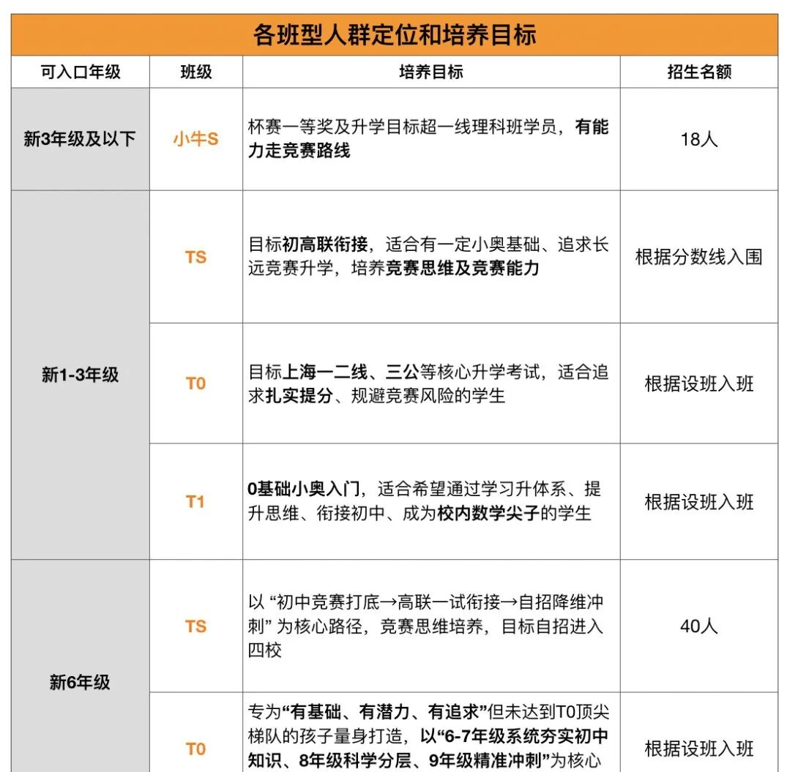

最近又到了沪上高端班集体出动的时候。

上海升学两大考，第一学校考，第二机构考。

魔都机构的高端班，每年会在固定的时间段线下开放选拔，俗称开放日，主要针对小学1-5年级。定位越高的高端班，选拔要求越严格，类似学校理科班，配备的是最好的老师和资源。

机构高端班开放日都是线下的，一般一年1-2次，4月和10月。也有的机构一个月一次。

今年出现了一个从没见过的高端班，叫TS班。

因为2025年起，上海SMK（神秘考）等核心升学通道对小奥的考核逻辑发生根本性转变，侧重考察学生扎实的数学思维、逻辑推理能力与知识应用能力，**超一线选拔都直接跳过难的小奥考核，考初联等能力。**

所以这个TS班就是为初高联衔接做准备，保留专业竞赛难度（偏数论组合）与训练体系，适合目标长远竞赛升学、有一定小奥基础的学生。

眼下，这个高端班首届公开招生开始，需要参加牛娃开放日择优入班。

这个牛娃开放日是面向新大班–新3年级、新6年级学员的综合性选拔活动。题目有一定难度，帮助课内成绩优秀、希望挑战自我的孩子精准定位学习路径。根据测评结果，推荐适合的班型。

这次牛娃开放日除了TS班招生，也有几点很有优势：

1.双轨并行的小奥体系，可以精准匹配不同升学需求。

**三大分层体系：TS体系（竞赛专精）、**T0体系（升学实用）、T1体系（入门拓展）。很贴合上海学生的多元路径，既保留专业竞赛赛道（TS），又打造适配上海升学的实用赛道（T0/T1），满足不同学生的核心需求。

****

2.**回归本质，思维优先。**培养孩子独立思考与知识应用能力，而非套路解题。

传统“偏、难、怪”的竞赛式小奥训练，已不再适配当前上海升学的核心需求，反而成为学生负担。所以TS/T0/T1三大体系就全面对标上海新升学趋势，彻底摒弃“偏难怪”的小奥套路，打造一套**适合上海学生、能真正提升思维、助力升学**的全新小奥体系。

3.顶尖一线名师授课，系统锁定上海“超一线”顶尖初中的稀缺通道。

老师确实很不错。据说小牛S和小奥TS都是汪烨亲授，T0和T1也都是一线口碑名师授课。此外教研团队强大，熟悉上海各大理科班的考情以及内容。

4.以考代练，精准定位。

最后，这次活动是与全上海最优秀的孩子同场竞技，不管任何程度的学生在这都可以找到适合自己的定位。

牛娃开放日---新1年级备考群

牛娃开放日---新2年级备考群

牛娃开放日---新3年级备考群

牛娃开放日---新6年级备考群

  

其实好的分层，从来不是把孩子分成三六九等，而是让每个孩子都能在适合的节奏里进步，让每一步学习都对接清晰的升学目标。

这次开放日是一次免费的学情诊断，帮家长摸清孩子水平、找准适配路径，想给孩子做精准升学规划、了解适配班型的家长，可以进群参与。

\*本文为推广合作