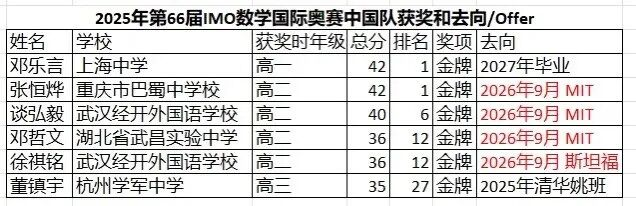
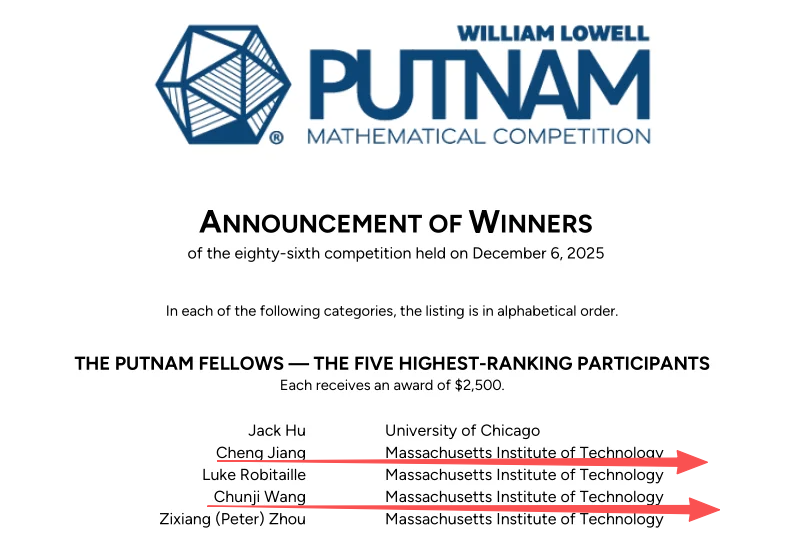
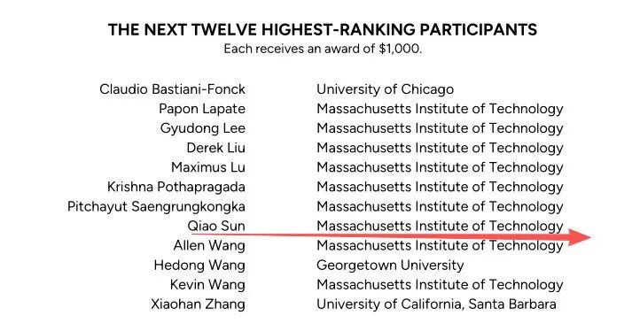
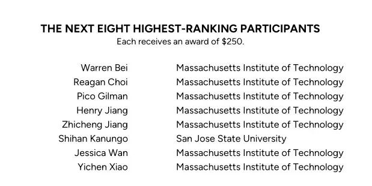

最近，随着美国各大高校offer放榜，鸡娃圈的老母亲们敏锐地发现：去年我们数竞国家队的6位IMO金中，除了当时已经高三的董镇宇最终选择去了清华姚班，其余还没到高三的5人虽然当时都签约了北大数学学院，但结果，邓哲文、徐祺铭、谈弘毅、张恒烨在变成高三毕业生的时候，都最终选择了MIT（麻省理工）或斯坦福，北大预科成了高中时期的过渡……再低1个年级的邓乐言虽然目前去向未定，但大家猜测应该也会学习自己上中学长的选择，明年也选择去麻省理工吧。

大家都被秀到了：原来，IMO金的最差出路是进姚班……IMO金们看不上的资源对我们普娃家长来说是梦寐以求的。

于是，我只配吃吃瓜，看看爽文男主的选择：

\-邓同学和徐同学都是高一、高二连续2年的IMO金得主，这种情况申请MIT就比较稳当。但徐同学最终很有个性地弃了MIT，选择了斯坦福。

\-谈同学在麻省理工的早申中被defer，最后拿到了RD，另外手上还有个牛津的offer，大概觉得牛津已在向港大看齐，比起哈耶普斯麻还差一截的缘故，最后选择了MIT。

说到MIT，最近六连冠了北美难度最高的本科生数学竞赛——普特南数学竞赛。前5名的获奖选手里IMO金选手浓度极高，甚至上海中学的浓度极高。

前五名中，江城获2022IMO满分金牌，毕业于上海中学；王淳稷获2023IMO满分金牌和2024IMO两届IMO金牌，同样毕业于上海中学；Jack Hu的中学来自星河湾，也算是上中系；Peter Zhou是加拿大赫赫有名的华裔，IMO和IOI的双料金牌，唯一的白人学生Luke Robitaile也是IMO金。

另外，在6-17名里，看到了孙启傲，他获2023年IMO金，也同样毕业于上海中学。18-25名有姜志城，毕业于深圳中学的IMO金，肖懿宸，女奥选手，来自成都七中。

不得不说，MIT里来自中国的IMO金真的好多，他们继续进阶到美国的竞赛舞台上熠熠生辉。

[大陆仅2枚MIT早申offer，全归竞赛娃！](https://mp.weixin.qq.com/s?__biz=MzAxNDc3ODQxNg==&mid=2247503899&idx=1&sn=204105d6087b71fa48265af7d5e4d43a&scene=21#wechat_redirect)

[摘得MIT早申offer的三位牛娃](https://mp.weixin.qq.com/s?__biz=MzAxNDc3ODQxNg==&mid=2247494441&idx=1&sn=451a9e6692b6b338ec59b668fea9cbad&scene=21#wechat_redirect)

最后，顺便说一下这个普特南数学竞赛究竟有多厉害。有一种说法在硅谷和华尔街广为流传：一旦你的名字出现在普南特前100名的榜单上，所有顶尖公司的大门都会想你敞开。量化基金、投行、科技巨头强的就是普特南和IMO中筛选出来的“最强大脑”。前5名获奖者据说是华尔街以他们的加入为荣。于是，那些学霸们就这样完成了从考试到赚钱的完美闭环。