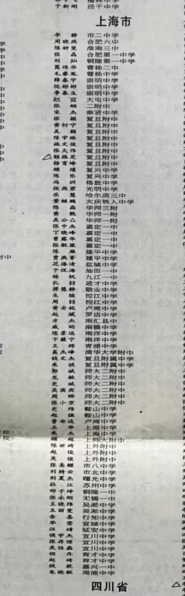
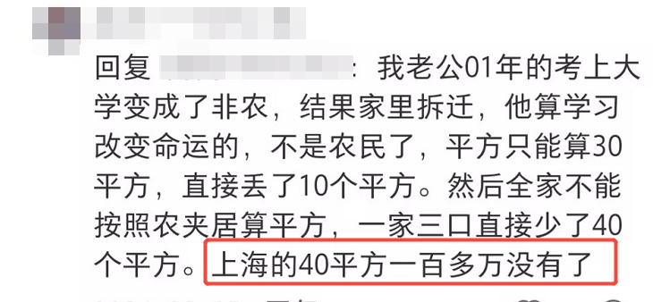
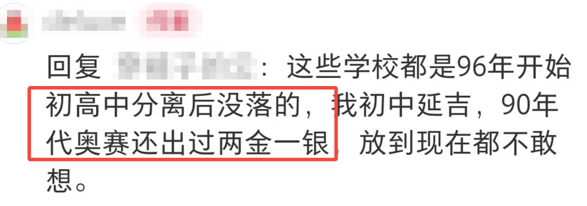

上世纪90年代末，清华在上海的生源分布相对平均。

我们找到了1999年的清华录取生源清单，嘉定一中4人、崇明中学3人、吴淞中学2人、宜川中学2人……赫然在榜的还有曹杨中学、光明中学、华师三附、罗店中学、周浦中学、南汇县中等等。

而我们更熟悉的四校，完全不似现在“屠榜”的辉煌。

世纪交替之间的上海，是怎样的升学景象？

1、当时没有“四校”概念

汽车少、地铁少，这就是上世纪末的上海现实。

交通工具的受限，大大缩减了通勤的半径范围。对于好学生来说，就近入学是上策，家门口的本区市重就是最佳选择。

那时候，基本一个区一个市重，徐汇南模、黄浦格致、卢湾向明、杨浦控江、静安市西、南市大同。

郊县的学生也有就近入学的自由，嘉定一中、南汇县中、崇明中学、奉贤中学。身在郊县，但办学水平从不落于人后。

“掐尖”一词进入公众视野之前，升学的繁荣景象就是好生源遍地开花。

2、不想迁户口

当时，考入外地大学是需要迁移户口的。

及至2004年，上海市教委才正式发文，明确规定上海生源考入外地大学可以不迁户口（遵循自愿原则），不迁户口不影响入学、学籍与毕业。

“户口迁出去，感觉变成外地人了”是当时很多上海生源的想法。考虑到这一点，“清北不如复交”的念头也在上海考生的心里扎了根。

下图，一位网友曾谈及“强制迁户口”带来的影响：

3、初高分离

2000年前后，上海开始逐渐提出“初高中分离”的思路，准确来说，是重点高中（非完中）的初高脱钩。

这一举措或许是为了保障教育公平：避免重点高中内部垄断、挖掘更多潜力生源，但从结果来看，初高脱钩确实较大程度限制了高中自有的生源池水平。

比如，上中在2003年彻底完成初高中分离；延安中学在1998年实现初高中部分脱钩办学，并于2003年更名为上海市延安初级中学。

而未分离前的重点高中，生源池是有相当保障的。比如曾经的鞍山中学一直有清北生，00级的宋清逸就是鞍山中学毕业的，但在鞍山中学分离为鞍山初级中学和同济一附以后，我们再没有见到过这份荣光。

下图，一位延吉中学的网友提起曾经的辉煌：

4、保送

当年，华二全国理科班有保送名额。

这是华二作为竞赛强校的历史遗迹，比如名单中的钱文杰就是两届IOI金牌。

尽管历史久远，但从名单中的校名来推断，“师大二附中”的生源大概率是保送生源，而“二附中”的那位学生可能是华二当年高考进清华的独苗。

也就是说，如果去掉华二的保送名额，该校考入清华的生源有时不如某些区重。

5、知青子女

历史原因，当年仍有很多知青子女，高中在外地就读，而升学时则以上海考生的身份参与高考。

这或许是名单中频繁出现外地高中，如合肥六中、淮安三中的原因，也就是说，这一批生源大概率是知青子女回沪考生。

感谢知青们为祖国建设做出的贡献。

6、如今

新旧世纪交替的上海，还有很多故事可以讲。

比如，清北尽管启动了“零志愿”，但复交也在努力争夺生源，据某位98年参与高考的生源回忆：当年复交给各个高中发推荐表，对好学生有相关的加分政策，但条件是零志愿不能填清北。

这是高校间的拉锯和博弈。

再比如，当年的清北也没有这么大的学科统治力，二十多年前，复旦的国贸和金融录取分几乎追平光华、同济的建筑土木城规分数也不低，对交大造成了分流等等。

不止高中，当年的学科选择也是百花齐放。

如今我们来到了2026年，曾经的故事已经渐渐隐入尘烟。

这篇回忆，送给“清北不如复交”的社会变迁、送给“知青子女”的恢弘历史、送给“初高脱钩”的教育改革。

延伸阅读：

[请交齐：上中的最后一份数学作业](https://mp.weixin.qq.com/s?__biz=MzkyMjc0NDYxOA==&mid=2247488144&idx=1&sn=59fc2ad319b02c926fb801c6a2eb8fd9&scene=21#wechat_redirect)

[上海市重：校长们的第一学历是？](https://mp.weixin.qq.com/s?__biz=MzkyMjc0NDYxOA==&mid=2247488128&idx=1&sn=280f08661e817ef3465020a16ef1fcdf&scene=21#wechat_redirect)

[谁能用“体育2小时”爆改上海高中生？](https://mp.weixin.qq.com/s?__biz=MzkyMjc0NDYxOA==&mid=2247488117&idx=1&sn=b442b2a3811aca7b7f771bb7b892fcc1&scene=21#wechat_redirect)

[上海最后几所“非衡水市重”，谁在坚守？](https://mp.weixin.qq.com/s?__biz=MzkyMjc0NDYxOA==&mid=2247488106&idx=1&sn=4ba222812139f5b5f20205bb3622a1cc&scene=21#wechat_redirect)

[上海盲童，高考挤进全市前10？](https://mp.weixin.qq.com/s?__biz=MzkyMjc0NDYxOA==&mid=2247488096&idx=1&sn=cc1e8d0ee1e88c518395d15ff9816ba0&scene=21#wechat_redirect)

[读过上海四校八大的明星们](https://mp.weixin.qq.com/s?__biz=MzkyMjc0NDYxOA==&mid=2247488072&idx=1&sn=867ad1fb0e5f905df2f6f80831119e28&scene=21#wechat_redirect)

[上海耀中门口接孩子，偶遇陈小春](https://mp.weixin.qq.com/s?__biz=MzkyMjc0NDYxOA==&mid=2247488064&idx=1&sn=b0729968d1e16fed9ffee70092c1a385&scene=21#wechat_redirect)

[上海滩下一个邓乐言会是谁？](https://mp.weixin.qq.com/s?__biz=MzkyMjc0NDYxOA==&mid=2247488054&idx=1&sn=43b22c7e9e1d357d497838f0f3810dd3&scene=21#wechat_redirect)

[在二手书里发现了复附学生的成绩单……](https://mp.weixin.qq.com/s?__biz=MzkyMjc0NDYxOA==&mid=2247488046&idx=1&sn=c2a94acc4b8b00b0fa208d19dcf088fe&scene=21#wechat_redirect)

[“那年我高考失误，勉强进了清华”](https://mp.weixin.qq.com/s?__biz=MzkyMjc0NDYxOA==&mid=2247488039&idx=1&sn=2b5c79ca901897b171380bbde32f03d5&scene=21#wechat_redirect)

[上中聊天局（下）：活用ai、满分秘密](https://mp.weixin.qq.com/s?__biz=MzkyMjc0NDYxOA==&mid=2247488026&idx=1&sn=02bc850eb31f189a11541eb57ceedaba&scene=21#wechat_redirect)

欢迎关注曹老师，获取更多升学内容：

 或请扫码与许愿老师联系： 

