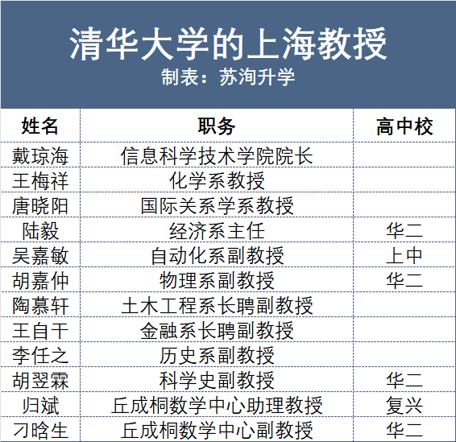
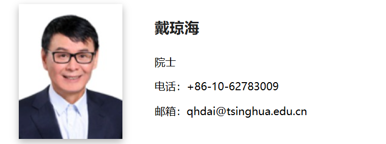
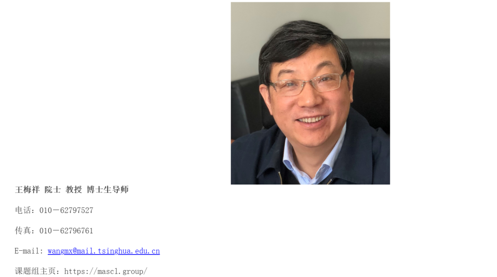
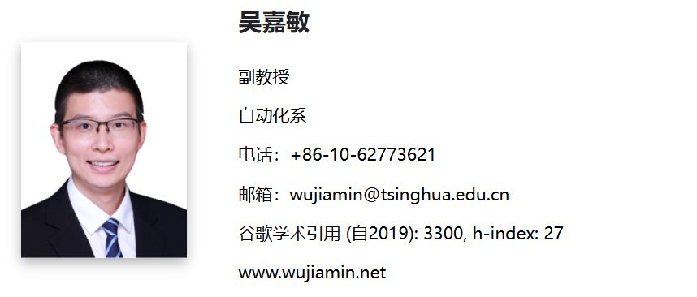
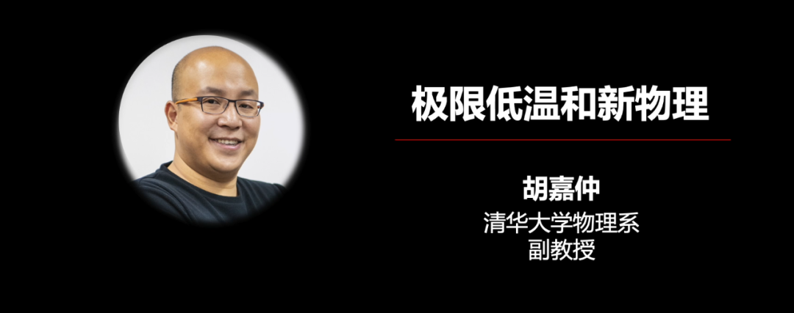
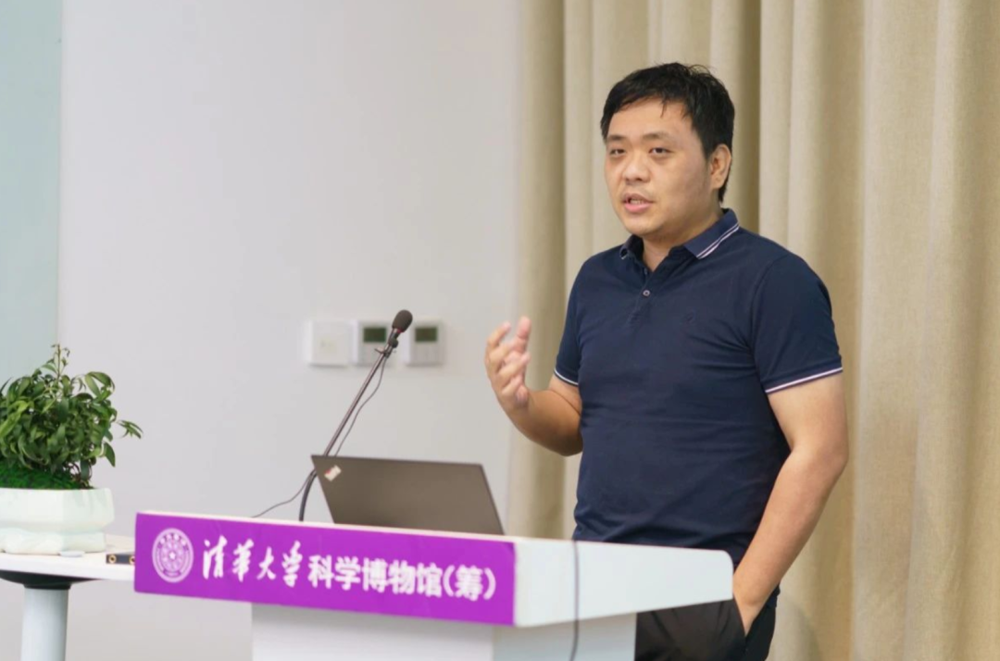
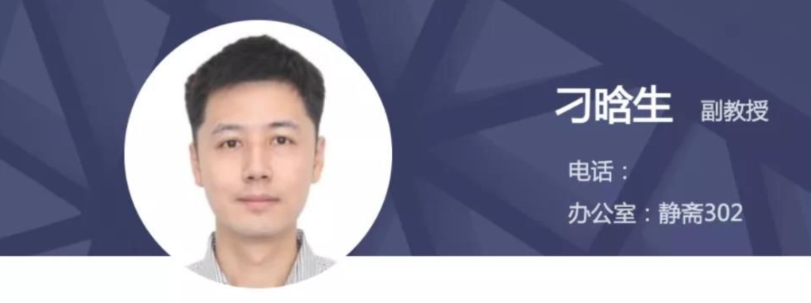
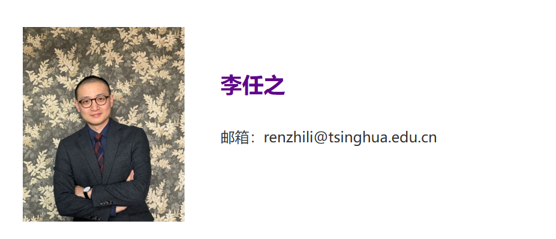
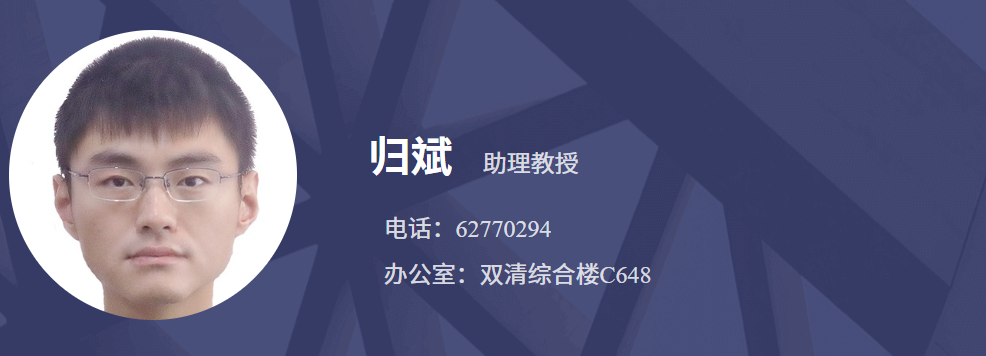

清华大学的中青年学者中，有不少上海学生。（注：所有内容来自互联网公开信息。）

我们整理了一份清华中的上海教授名单，华二和上中输送最多生源。

在可搜集的信息中，我们发现上中生源（土生土长的金山人）吴嘉敏、华二生源胡嘉仲均已就任副教授，且年纪不到40岁，俨然已是清华的中坚和新生力量。

而在整理更年长的学者经历时，我们仅能确定他们出生于上海，但高中不详。一方面是时间久远造成的资料缺漏，还有一方面是当年的许多高中存在撤销或解组的情况，导致校情不可考。

也欢迎知情人补充。

戴琼海（院士）：

清华信息科学技术学院院长。1964年生于上海，1983年考入陕西师范大学数学专业，1987年至1992年间担任新疆跃进钢铁厂工程师，后获得东北大学计算机应用专业硕士学位和自动化专业工学博士学位。

戴琼海也是下文吴嘉敏的导师。

戴琼海院士就读高中的年代太过久远，欢迎知情人士补充。

王梅祥（院士）：

清华化学系教授、博导。1960年生于上海，是恢复高考制度之后第三批参加高考的学子，1979年从上海考入复旦大学化学系，1986年考入中国科学院化学研究所，先后获得理学硕士、博士学位。

吴嘉敏：

清华自动化系副教授。师从上文中的戴琼海院士，金山生源，上海中学2010届毕业生。

胡嘉仲：

清华物理系副教授。华师大二附中（1班“自塑教育”试点班）2007届毕业生，2007年国际物理奥赛金牌。清华毕业后，进入MIT攻读物理学博士学位，师从2001年诺贝尔物理学奖得主Wolfgang Ketterle教授。

胡翌霖：

清华科学史系副教授（已离职）。华师大二附中（全国理科实验班）2004届毕业生。北大哲学系本科，科学技术哲学专业硕士、博士，北师大哲学院博士后。  

胡翌霖离职后搬至新加坡生活，2005年曾参与一档播客，探讨了“非升即走”的学术机制对青年学者的影响，并表达了其对比特币、NFT等领域的深度见解。

刁晗生：

清华丘成桐数学科学中心副教授。华师大二附中2006届毕业生，师从杭顺情等数学教练，第46届IMO满分金牌，后保送至北大数学系，继而转学至MIT。

李任之：

清华历史系副教授。1989年出生于上海，2015年、2015年获得清华大学历史学学士和世界史硕士学位，2019年于牛津大学获博士学位。

归斌：

清华丘成桐数学科学中心助理教授。复兴高级中学2009届毕业生，2006年，归斌在数学四大顶刊《Inventiones Mathematicae》发表独作。

延伸阅读：

[清华1999年的上海生源](https://mp.weixin.qq.com/s?__biz=MzkyMjc0NDYxOA==&mid=2247488156&idx=1&sn=b191a1613bd84748bf3229549f1ab5c6&scene=21#wechat_redirect)

[请交齐：上中的最后一份数学作业](https://mp.weixin.qq.com/s?__biz=MzkyMjc0NDYxOA==&mid=2247488144&idx=1&sn=59fc2ad319b02c926fb801c6a2eb8fd9&scene=21#wechat_redirect)

[上海市重：校长们的第一学历是？](https://mp.weixin.qq.com/s?__biz=MzkyMjc0NDYxOA==&mid=2247488128&idx=1&sn=280f08661e817ef3465020a16ef1fcdf&scene=21#wechat_redirect)

[谁能用“体育2小时”爆改上海高中生？](https://mp.weixin.qq.com/s?__biz=MzkyMjc0NDYxOA==&mid=2247488117&idx=1&sn=b442b2a3811aca7b7f771bb7b892fcc1&scene=21#wechat_redirect)

[上海最后几所“非衡水市重”，谁在坚守？](https://mp.weixin.qq.com/s?__biz=MzkyMjc0NDYxOA==&mid=2247488106&idx=1&sn=4ba222812139f5b5f20205bb3622a1cc&scene=21#wechat_redirect)

[上海盲童，高考挤进全市前10？](https://mp.weixin.qq.com/s?__biz=MzkyMjc0NDYxOA==&mid=2247488096&idx=1&sn=cc1e8d0ee1e88c518395d15ff9816ba0&scene=21#wechat_redirect)

[读过上海四校八大的明星们](https://mp.weixin.qq.com/s?__biz=MzkyMjc0NDYxOA==&mid=2247488072&idx=1&sn=867ad1fb0e5f905df2f6f80831119e28&scene=21#wechat_redirect)

[上海耀中门口接孩子，偶遇陈小春](https://mp.weixin.qq.com/s?__biz=MzkyMjc0NDYxOA==&mid=2247488064&idx=1&sn=b0729968d1e16fed9ffee70092c1a385&scene=21#wechat_redirect)

[上海滩下一个邓乐言会是谁？](https://mp.weixin.qq.com/s?__biz=MzkyMjc0NDYxOA==&mid=2247488054&idx=1&sn=43b22c7e9e1d357d497838f0f3810dd3&scene=21#wechat_redirect)

[在二手书里发现了复附学生的成绩单……](https://mp.weixin.qq.com/s?__biz=MzkyMjc0NDYxOA==&mid=2247488046&idx=1&sn=c2a94acc4b8b00b0fa208d19dcf088fe&scene=21#wechat_redirect)

[“那年我高考失误，勉强进了清华”](https://mp.weixin.qq.com/s?__biz=MzkyMjc0NDYxOA==&mid=2247488039&idx=1&sn=2b5c79ca901897b171380bbde32f03d5&scene=21#wechat_redirect)

[上中聊天局（下）：活用ai、满分秘密](https://mp.weixin.qq.com/s?__biz=MzkyMjc0NDYxOA==&mid=2247488026&idx=1&sn=02bc850eb31f189a11541eb57ceedaba&scene=21#wechat_redirect)

欢迎关注曹老师，获取更多升学内容：

 或请扫码与许愿老师联系： 

