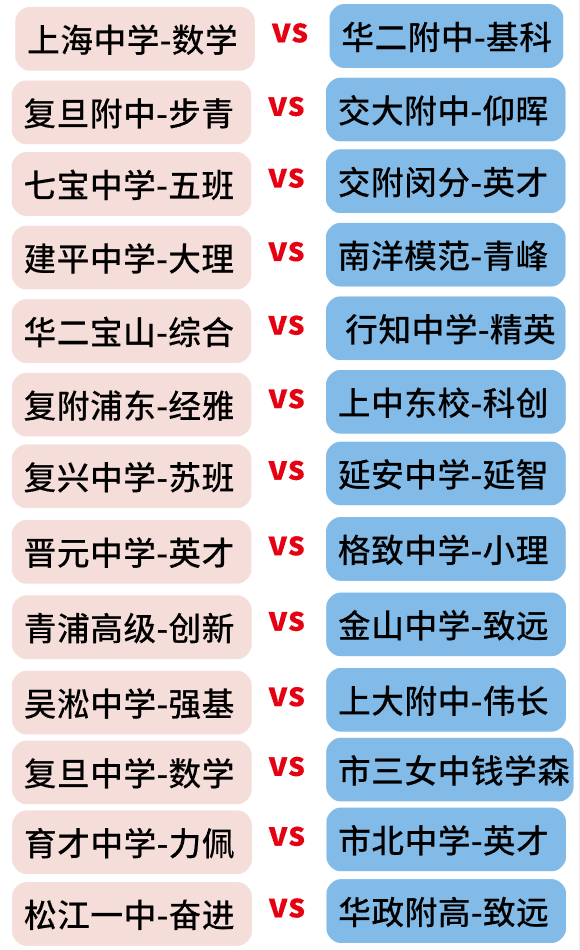
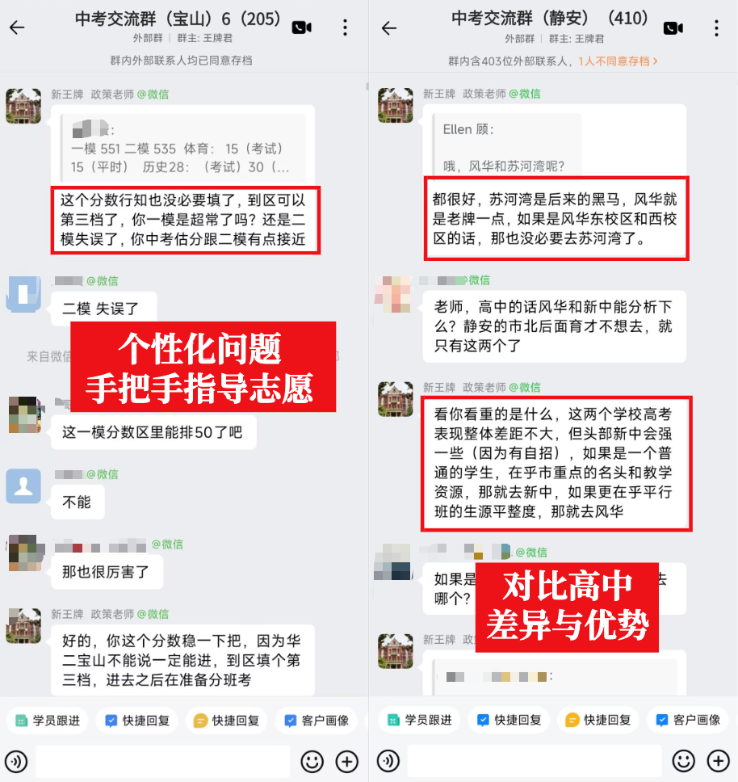
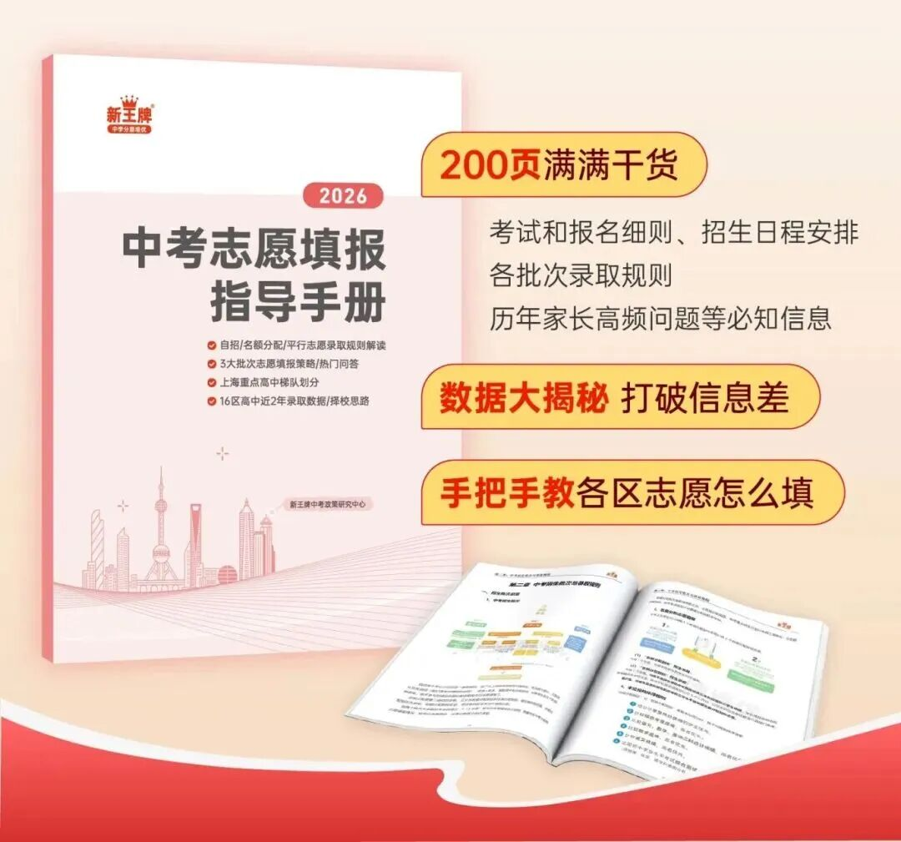
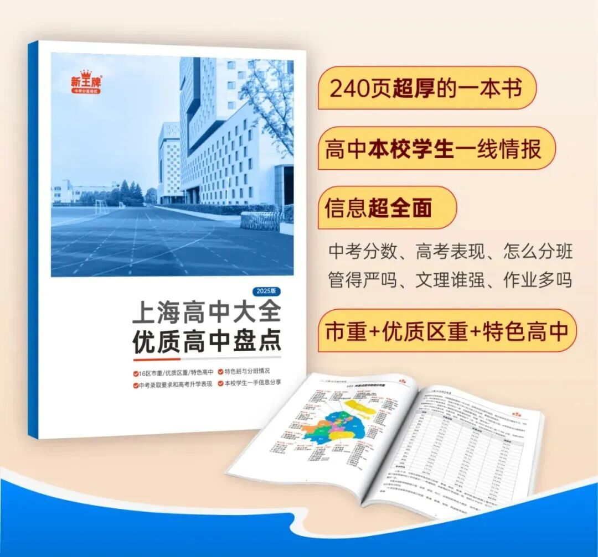
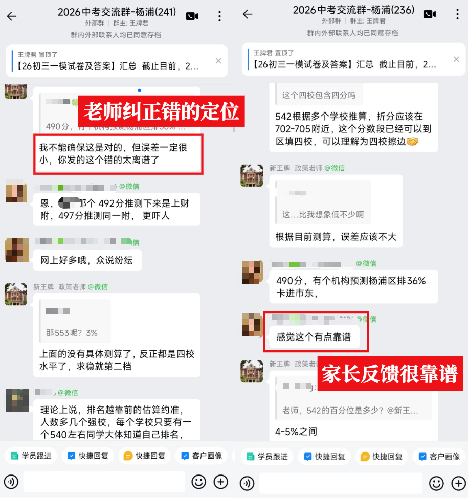
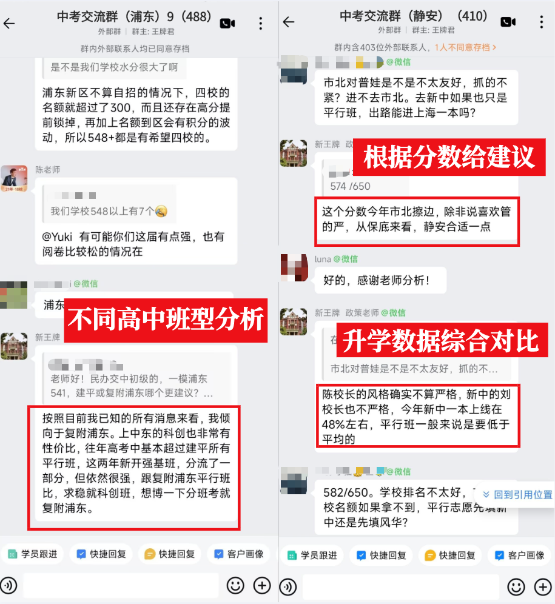
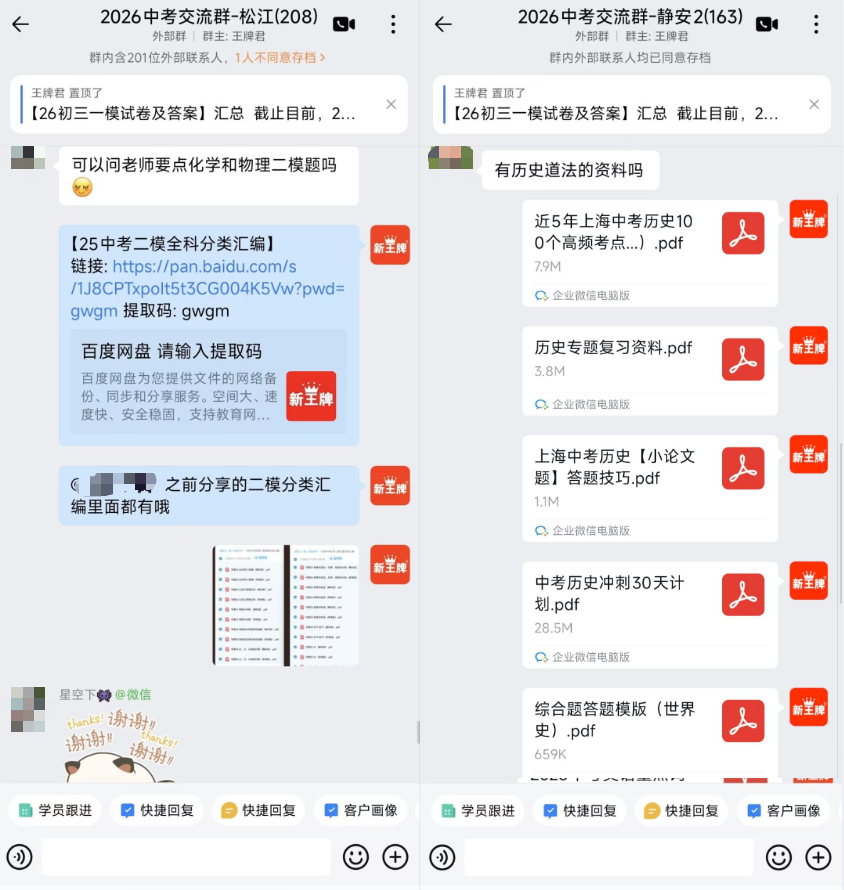

快中考了，孩子负责提分，咱们家长负责收集各路消息。

尤其孩子成绩不错，要考虑的不仅仅是选哪个高中，还要考虑“哪个班”？

  

能把比较的颗粒度精细到“班”，而且还是根据学校最新情况来分析的，只有这个群的老师有这个实力。我接触上海中考这么多年，也对比过不少群。**真正让我觉得专业、值得推荐的，必须是这一个。**

**1.群消息很“新”，全是今年的一手信息**我都很佩服他们是怎么做到的，原来他们从不轻信网上的消息，都是花了大量时间去收集的一手信息。花了功夫的就是不一样。  
  
**2.有问必答，等于有个免费专家随时答疑  
**尤其是在志愿填报前，大家会遇到很多具体的问题，去年晚上11点多还有老师在里面实时解答，等于在你最困惑的时候，有个专家能随时给你答疑，挺划算的！

  

**3.躺着“拿资料”，每周都有投喂**

每个礼拜至少投喂两个实用资料。最近快二模了，我看他们把所有科目的历年二模真题整理成专题练习，你们可以根据孩子哪块薄弱对应练哪块，还有解析答案，资料都很实用。  
  

**4.消息很快，各位群里“坐等”就行了**

你不用到处打听搜集，进了群等着就行。招生计划、最新政策一发布他们都是第一时间发群里，而且把不同批次的数据汇总成表、各种分析基本会直接“喂”给你。

  

这是一个纯公益、高质量的家长交流群，目标要进上海市重、区重的家长，可以进群挖最新的消息。

👇

**扫码回复【所在区】**

  

反正没什么成本，鼓励你们都进去，跟孩子做决策前先把细节、各种消息打探清楚、多领点资料，一点都不亏。在这个奋斗的夏天，你们不是孤岛，一起在群里交流互助！

**现在进群还能领两本纸质书，参加活动包邮到家****。**一本是《中考志愿填报指导手册》，一本是《上海高中大全》，430多页都是干货。找本校的学长学姐搜集了学校一手校情，包含高考表现、分班情况、管理松严、作业量等家长们关心的信息。还有老师写的各区志愿填报的具体建议，我听领到的家长反馈说内容很专业，挺实用的。

**纸质书免费包邮到家**

**《中考志愿指导手册》**

**各类数据/志愿填报指导**

  

**《上海高中大全》**

**本校学长帮你汇总一手情报**

  

  

  

  

  

  

**扫码添加老师👇**

我**拉你进<所在区中考群>参与领书活动**

  

  

我跟群主深入了解后，  
帮大家总结一下这个群会有什么帮助？

****👇👇👇****

 01

  

****二模定位，中考志愿答疑****

  

每年一二模定位，网上各种"民间定位"版本，相差很大，就像今年家长在群里分享了一个机构的定位，感觉很靠谱，群里老师直接告知错的离谱！

  

  

这个群里面的政策讲师何老师，**他会非常慎重地给定位，发出来的定位都是自己实打实计算出来的。从来不从网络上直接搬运。**所有的数据都是通过搜集大量真实学生的成绩，结合这些年对各区初中升学走向的了解，把当年数据和历年经验结合起来，综合计算出独家、精准的定位参考。

  
**二模后，大家可以在群里获取何老师计算过的定位参考**，但有一点，计算是要花时间的，就不能很快，你们看到那种很快出的，很多拿着往年的定位来忽悠，真正靠谱的，是很费功夫的。  
  
另外，**何老师还会在群里1v1答疑**，从定位、志愿填报到高中内部消息，**哪怕是"XX中学重点班和平行班的师资差距"这种细节问题。**他都耐心解答，帮大家把择校、填志愿的难题一一捋顺。  
  

  

 02

  

****二模、中考给答案，帮助估分****

  

今年一模考，很快群里就分享了试卷和答案。等到二模考，群里也会第一时间更新试卷、答案。尤其是去年中考，趁着孩子还能回忆起答题内容，急需第一时间对答案，他们会第一时间搜集试卷，安排老师提供答案，供大家估分核对。还给出了与去年相比难度比较。

  

  

 03

  

****备考学习资料，又多又快****

  

群里发资料的速度和质量也让人点赞：  

A妈："松江群求化学和物理二模题！"

老师秒发：25中考二模全科分类汇编原卷+解析

B爸："有没有中考历史道法资料？"

很快收到：近5年中考历史100个高频考点+历史专题复习资料+综合题答案模版+中考道法复习+跨学科案例满分宝典+跨学科必刷100题。

  

  

****👇👇👇****

****2026上海16区中考交流群******扫码回复【所在区】******进群****

最后说句心里话：中考路上难免焦虑，希望这个群不只是信息港湾，家长们也可以交流认识，抱团互助，未来说不定还是高中校友家长团。

本文为广告，请理性选择