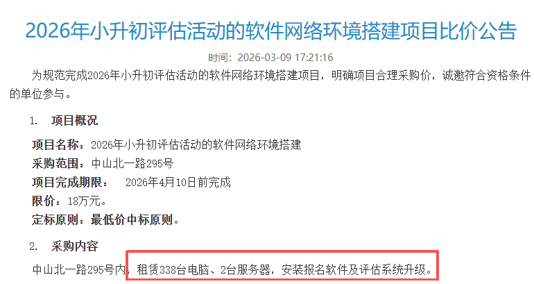
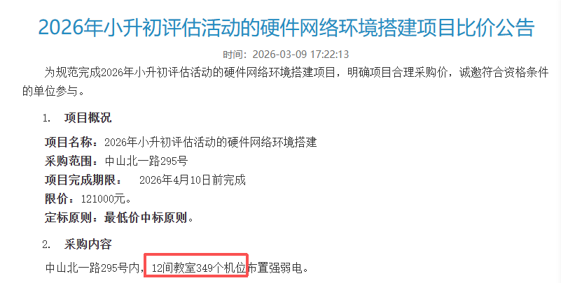

最近，有一直在关心三公报名通知的细心家长发现：上外附中的学校官网上张贴了“2026年小升初评估活动的软件、硬件网络环境搭建项目的比价公告”。

根据比价公告，可以预计今年上外附中会继续沿用去年的纯机考试。再顺便翻看历史校务公告，去年并没有网络环境搭建的比价公告，大家开始猜测：莫非今年的纯机考试要升级了？

另外，根据租赁数量，再结合去年分成的6个批次，莫非今年的面单数可以达到338\*6=2028？

项目需要在4月10日前完成，估计4月10日开始网上申报吧？和去年的网申时间线也正好一致。

让我们静待今年三公的消息！

相关阅读：

[2025三公考试考情分享](https://mp.weixin.qq.com/s?__biz=MzAxNDc3ODQxNg==&mid=2247505998&idx=1&sn=3ea84d11883d8e11a7f61cf587cc7915&scene=21#wechat_redirect)

[小升初收官：三公开招，各有变动！](https://mp.weixin.qq.com/s?__biz=MzAxNDc3ODQxNg==&mid=2247505840&idx=1&sn=cd4adc4102ad126c70c76a2570ef8b20&scene=21#wechat_redirect)

[三公面单给了什么样配置的娃？](https://mp.weixin.qq.com/s?__biz=MzAxNDc3ODQxNg==&mid=2247505954&idx=1&sn=2715ef63da67cf5d5616e0abf0c330bc&scene=21#wechat_redirect)